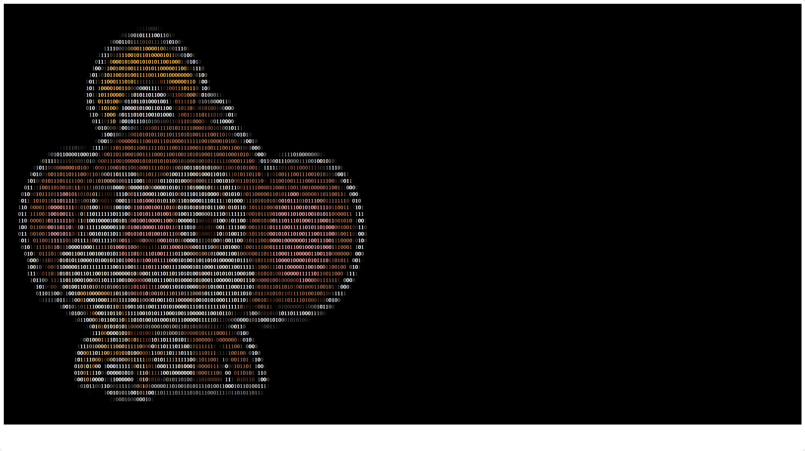

# 一、Windows-Terminal

## 1.1 安装 oh-my-posh

```shell
# 安装（注意环境变量）
$ winget install JanDeDobbeleer.OhMyPosh -s winget
# 下载 nerd 字体
# 使用
$ New-Item -Path $PROFILE -Type File -Force
$ notepad $PROFILE
oh-my-posh init pwsh | Invoke-Expression
$ . $PROFILE
$ oh-my-posh disable notice
# 编辑配置文件去掉 shell 字段和 time 字段
$ oh-my-posh config export --output ~/.mytheme.omp.json
$ notepad++ .\.mytheme.omp.json
# 重新配置命令
$ notepad++ $PROFILE
oh-my-posh init pwsh --config ~/.mytheme.omp.json | Invoke-Expression
. $PROFILE
```

## 1.2 配置 ssh、git

```shell
# 创建密钥对
$ ssh-keygen -t rsa -b 4096 -C "shiyuhanga@163.com"
# 查看公钥并将其复制到 github 上
$ cat ~/.ssh/id_rsa.pub
$ ssh -T git@github.com
# 配置 git
$ git config --global user.name "sxhwin"
$ git config --global user.email "shiyuhanga@163.com"
$ git config --global color.ui auto
$ git config --global http.proxy 127.0.0.1:7890
$ git config --global https.proxy 127.0.0.1:7890
$ git config --global --list
```

## 1.3 配置仓库

```shell
# 两种克隆方式二选一
$ git clone git@github.com:sxh12138/AboutLearing.git
$ git clone https://github.com/sxh12138/AboutLearing.git
# 添加推送
$ cd ~/AboutLearing
$ git add .
$ git commit -m "1"
$ git branch -M main
$ git push -u origin main --force
$ git branch --set-upstream-to=origin/main main
```

## powershell 常见命令

```shell
# 查看端口信息并用 wsl 的 grep 命令过滤（wsl2 版本支持命令相互调用）
$  netstat -an | wsl grep 192.168.1.66

1. **获取命令帮助**：
   - `Get-Help <cmdlet>`：获取特定命令的帮助信息。
   - `man <cmdlet>`：同上，另一种获取帮助的方式。

2. **查看和设置位置**：
   - `Get-Location`：显示当前目录。
   - `Set-Location <path>`：更改当前目录。

3. **文件和目录操作**：
   - `Get-ChildItem` 或 `dir`：列出目录内容。
   - `Get-Item <path>`：获取文件或目录的属性。
   - `New-Item <path>`：创建新的文件或目录。
   - `Remove-Item <path>`：删除文件或目录。
   - `Copy-Item <source> <destination>`：复制文件或目录。
   - `Move-Item <source> <destination>`：移动文件或目录。

4. **查看和修改环境变量**：
   - `Get-ChildItem Env:`：列出所有环境变量。
   - `$env:<variable>`：获取或设置环境变量。

5. **服务管理**：
   - `Get-Service`：列出所有服务。
   - `Start-Service <name>`：启动服务。
   - `Stop-Service <name>`：停止服务。
   - `Restart-Service <name>`：重启服务。

6. **进程管理**：
   - `Get-Process`：列出所有运行中的进程。
   - `Start-Process <application>`：启动新的进程。
   - `Stop-Process <id>`：停止进程。

7. **远程管理**：
   - `Enter-PSSession <computername>`：进入远程会话。
   - `Exit-PSSession`：退出远程会话。

8. **查看和修改系统设置**：
   - `Get-WmiObject Win32_OperatingSystem`：获取操作系统信息。
   - `Get-ComputerInfo`：获取计算机的详细信息。

9. **网络管理**：
   - `Test-Connection <computername>`：测试与远程计算机的连接。
   - `Get-NetIPAddress`：获取网络适配器的IP地址。

10. **软件包管理**（需要安装 PowerShellGet）：
    - `Find-Module`：在PowerShell Gallery中搜索模块。
    - `Install-Module <module>`：安装模块。
    - `Get-InstalledModule`：列出已安装的模块。

11. **脚本和配置**：
    - `Get-Content <path>`：读取文件内容。
    - `Set-Content <path> <value>`：写入文件内容。
    - `Invoke-Expression`：执行字符串形式的命令。

12. **错误处理**：
    - `try { <script block> } catch { <script block> }`：捕获和处理错误。

13. **管道和筛选**：
    - `Where-Object { <script block> }`：过滤对象。
    - `ForEach-Object { <script block> }`：对对象执行操作。
    - `Sort-Object <property>`：按属性排序对象。

14. **查看和修改权限**：
    - `Get-Acl <path>`：获取文件或目录的访问控制列表。
    - `Set-Acl <path> <acl>`：设置文件或目录的访问控制列表。

15. **定时任务**：
    - `Get-ScheduledTask`：列出所有计划任务。
    - `Register-ScheduledTask <taskname>`：注册新的计划任务。
    - `Unregister-ScheduledTask <taskname>`：取消注册计划任务。
```

# 二、WSL-Ubuntu

## 2.1 安装配置 WSL2

```shell
$ wsl --update
$ wsl --status
$ cd
$ notepad++ .wslconfig
[wsl2]
memory=4GB
swap=4GB

[experimental]
autoMemoryReclaim=gradual
networkingMode=mirrored
dnsTunneling=true
firewall=true
autoProxy=true

# 用法: wsl.exe [Argument] [Options...][CommandLine]

# 运行 Linux 二进制文件的参数:

    如果未提供命令行，wsl.exe 将启动默认 shell。

    --exec、-e <CommandLine>
        不使用默认 Linux shell 执行指定命令。

    --
        按原样传递剩余命令行。

# 选项:
    --cd <Directory>
        将指定目录设置为当前工作目录。
        如果使用 ~，则将使用 Linux 用户的主路径。如果路径以 / 字符开头，
        它将被解释为绝对 Linux 路径。
        否则，该值必须是绝对 Windows 路径。

    --distribution、-d <Distro>
        运行指定的分发。

    --user、-u <UserName>
        以指定用户身份运行。

    --system
        为系统分发启动 shell。

# 用于管理适用于 Linux 的 Windows 子系统的参数:

    --help
        显示用法信息。

    --install [Options]
        安装其他适用于 Linux 的 Windows 子系统分发。
        有关有效分发的列表，请使用“wsl --list --online”。

        选项:
            --distribution、-d [Argument]
                按名称下载并安装分发。

                参数:
                    有效的分发名称(不区分大小写)。

                示例:
                    wsl --install -d Ubuntu
                    wsl --install --distribution Debian

            --no-launch, -n
                安装后不启动发行版。

    --mount <Disk>
        在所有 WSL2 分发中附加和安装物理磁盘。

        选项:
            --bare
                将磁盘附加到 WSL2，但不要装载它。

            --type <Type>
                装载磁盘时使用的文件系统，如果未指定，则默认为 ext4。

            --options <Options>
                其他装载选项。

            --partition <Index>
                要装载的分区索引，如果未指定，则默认为整个磁盘。

    --set-default-version <Version>
        更改新分发的默认安装版本。

    --shutdown
        立即终止所有正在运行的分发和 WSL 2
        轻型实用程序虚拟机。

    --status
        显示适用于 Linux 的 Windows 子系统的状态。

    --卸载 [Disk]
        从所有 WSL2 分发中卸载并分离磁盘。
        如果不带参数调用，则卸载并分离所有磁盘。

    --更新 [Options]
        如果未指定任何选项，将从 Microsoft Store 下载并安装 WSL。

        选项:
            --回滚
                恢复到 WSL 2 内核的先前版本。

            --inbox
                仅更新收件箱 WSL 2 内核。不从 Microsoft Store 安装 WSL。

            --web-download
                从 internet 而不是 Microsoft  Store 下载 WSL 的最新版本。
# 用于在适用于 Linux 的 Windows 子系统中管理分发的参数:

    --export <Distro> <FileName>
        将分发导出为 tar 文件。
        对于标准输出，文件名可以是 -。

    --import <Distro> <InstallLocation> <FileName> [Options]
        将指定的 tar 文件作为新分发导入。
        文件名可以是 - 用于标准输入。

        选项:
            --version <Version>
                指定用于新分发的版本。

    --list, -l [Options]
        列出分发。

        选项:
            --所有
                列出所有分发，包括当前
                正在安装或卸载的分发。

            --正在运行
                仅列出当前正在运行的分发。

            --安静的, -q
                仅显示分发名称。

            --详细的, -v
                显示有关所有分发的详细信息。

            --在线，-o
                显示可使用“wsl --install”安装的可用分发列表。

    --set-default, -s <Distro>
        将分发设为默认值。

    --set-version <Distro> <Version>
        更改指定分发的版本。

    --终止, -t <Distro>
        终止指定的分发。

    --取消注册 <Distro>
        取消注册分发并删除根文件系统。
```

## 2.2 安装配置 Ubuntu

### 2.2.1 下载安装

```shell
# 列出所有可供安装的发行版
$ wsl -l -o
# 安装 Ubuntu-24.04
$ wsl --install -d Ubuntu-24.04
#设置默认wsl版本以及默认发行版为 Ubuntu
$ wsl -l -v
$ wsl --set-default-version 2
$ wsl --set-default Ubuntu-24.04
# 安装完成，进入系统
$ wsl
```

### 2.2.2 配置 root 密码

```shell
$ sudo passwd root
123123
```

### 2.2.3 查看基本信息

```shell
# 查看 wsl.conf
$ cat /etc/wsl.conf
[boot]
systemd=true
# 查看版本信息
$ lsb_release -a
No LSB modules are available.
Distributor ID: Ubuntu
Description:    Ubuntu 24.04 LTS
Release:        24.04
Codename:       noble
$ cat /etc/os-release
PRETTY_NAME="Ubuntu 24.04 LTS"
NAME="Ubuntu"
VERSION_ID="24.04"
VERSION="24.04 LTS (Noble Numbat)"
VERSION_CODENAME=noble
ID=ubuntu
ID_LIKE=debian
HOME_URL="https://www.ubuntu.com/"
SUPPORT_URL="https://help.ubuntu.com/"
BUG_REPORT_URL="https://bugs.launchpad.net/ubuntu/"
PRIVACY_POLICY_URL="https://www.ubuntu.com/legal/terms-and-policies/privacy-policy"
UBUNTU_CODENAME=noble
LOGO=ubuntu-logo
# 查看磁盘及区分
$ df -h
Filesystem      Size  Used Avail Use% Mounted on
none            2.0G     0  2.0G   0% /usr/lib/modules/5.15.153.1-microsoft-standard-WSL2
none            2.0G  4.0K  2.0G   1% /mnt/wsl
drivers         892G  109G  784G  13% /usr/lib/wsl/drivers
/dev/sdc       1007G  1.5G  955G   1% /
none            2.0G   76K  2.0G   1% /mnt/wslg
none            2.0G     0  2.0G   0% /usr/lib/wsl/lib
rootfs          2.0G  2.2M  2.0G   1% /init
none            2.0G  648K  2.0G   1% /run
none            2.0G     0  2.0G   0% /run/lock
none            2.0G     0  2.0G   0% /run/shm
none            2.0G   76K  2.0G   1% /mnt/wslg/versions.txt
none            2.0G   76K  2.0G   1% /mnt/wslg/doc
C:\             892G  109G  784G  13% /mnt/c
D:\             954G  255G  700G  27% /mnt/d
E:\             954G  741G  214G  78% /mnt/e
tmpfs           392M   16K  392M   1% /run/user/1002
$ lsblk
NAME
    MAJ:MIN RM   SIZE RO TYPE MOUNTPOINTS
sda   8:0    0 388.4M  1 disk
sdb   8:16   0     4G  0 disk [SWAP]
sdc   8:32   0     1T  0 disk /mnt/wslg/distro
# 查看内存
$ free -h
               total        used        free      shared  buff/cache   available
Mem:           3.8Gi       821Mi       2.9Gi       3.1Mi       325Mi       3.0Gi
Swap:          4.0Gi          0B       4.0Gi
# 查看网络信息
$ ifconfig
Command 'ifconfig' not found, but can be installed with:
sudo apt install net-tools
$ ip addr
1: lo: <LOOPBACK,UP,LOWER_UP> mtu 65536 qdisc noqueue state UNKNOWN group default qlen 1000
    link/loopback 00:00:00:00:00:00 brd 00:00:00:00:00:00
    inet 127.0.0.1/8 scope host lo
       valid_lft forever preferred_lft forever
    inet 10.255.255.254/32 brd 10.255.255.254 scope global lo
       valid_lft forever preferred_lft forever
    inet6 ::1/128 scope host
       valid_lft forever preferred_lft forever
2: eth0: <BROADCAST,MULTICAST> mtu 1500 qdisc mq state DOWN group default qlen 1000
    link/ether cc:28:aa:1a:6d:0d brd ff:ff:ff:ff:ff:ff
3: eth1: <BROADCAST,MULTICAST,UP,LOWER_UP> mtu 1500 qdisc mq state UP group default qlen 1000
    link/ether 04:ec:d8:f5:80:48 brd ff:ff:ff:ff:ff:ff
    inet 192.168.1.66/24 brd 192.168.1.255 scope global noprefixroute eth1
       valid_lft forever preferred_lft forever
    inet6 2409:8a3c:11cd:8080:6e2:18fe:f913:a36c/64 scope global nodad deprecated noprefixroute
       valid_lft forever preferred_lft 0sec
    inet6 2409:8a3c:11cd:8080:5dff:a82d:2cbe:4509/128 scope global nodad noprefixroute
       valid_lft forever preferred_lft forever
    inet6 fe80::b9d:2ec3:9bde:b31c/64 scope link nodad noprefixroute
       valid_lft forever preferred_lft forever
4: loopback0: <BROADCAST,MULTICAST,UP,LOWER_UP> mtu 1500 qdisc mq state UP group default qlen 1000
    link/ether 00:15:5d:33:5e:83 brd ff:ff:ff:ff:ff:ff
$ ss -antp
State     Recv-Q Send-Q                             Local Address:Port                  Peer Address:PortProcess
LISTEN    0      4096                               127.0.0.53%lo:53                         0.0.0.0:*

LISTEN    0      4096                                  127.0.0.54:53                         0.0.0.0:*

LISTEN    0      1000                              10.255.255.254:53                         0.0.0.0:*

TIME-WAIT 0      0                                   192.168.1.66:47423                23.216.153.89:80

TIME-WAIT 0      0                                   192.168.1.66:47913                23.216.153.89:80

TIME-WAIT 0      0                                   192.168.1.66:45481                23.216.153.93:80

TIME-WAIT 0      0                                   192.168.1.66:45323                23.216.153.93:80

TIME-WAIT 0      0                                   192.168.1.66:48187                23.216.153.89:80

TIME-WAIT 0      0      [2409:8a3c:11cd:8080:5dff:a82d:2cbe:4509]:47733 [2600:140b:a00:3::17d8:9990]:80

TIME-WAIT 0      0      [2409:8a3c:11cd:8080:5dff:a82d:2cbe:4509]:48439 [2600:140b:a00:3::17d8:9990]:80

TIME-WAIT 0      0      [2409:8a3c:11cd:8080:5dff:a82d:2cbe:4509]:47417 [2600:140b:a00:3::17d8:998e]:80

TIME-WAIT 0      0      [2409:8a3c:11cd:8080:5dff:a82d:2cbe:4509]:47915 [2600:140b:a00:3::17d8:998e]:80

TIME-WAIT 0      0      [2409:8a3c:11cd:8080:5dff:a82d:2cbe:4509]:45661 [2600:140b:a00:3::17d8:998e]:80
# 查看 cpu
$ lscpu
Architecture:            x86_64
  CPU op-mode(s):        32-bit, 64-bit
  Address sizes:         39 bits physical, 48 bits virtual
  Byte Order:            Little Endian
CPU(s):                  32
  On-line CPU(s) list:   0-31
Vendor ID:               GenuineIntel
  Model name:            13th Gen Intel(R) Core(TM) i9-13980HX
    CPU family:          6
    Model:               183
    Thread(s) per core:  2
    Core(s) per socket:  16
    Socket(s):           1
    Stepping:            1
    BogoMIPS:            4838.41
    Flags:               fpu vme de pse tsc msr pae mce cx8 apic sep mtrr pge mca cmov pat pse36 clflush
                         mmx fxsr sse sse2 ss ht syscall nx pdpe1gb rdtscp lm constant_tsc rep_good nopl
                         xtopology tsc_reliable nonstop_tsc cpuid pni pclmulqdq vmx ssse3 fma cx16 sse4_1
                          sse4_2 x2apic movbe popcnt tsc_deadline_timer aes xsave avx f16c rdrand hypervi
                         sor lahf_lm abm 3dnowprefetch ssbd ibrs ibpb stibp ibrs_enhanced tpr_shadow vnmi
                          ept vpid ept_ad fsgsbase tsc_adjust bmi1 avx2 smep bmi2 erms invpcid rdseed adx
                          smap clflushopt clwb sha_ni xsaveopt xsavec xgetbv1 xsaves avx_vnni umip waitpk
                         g gfni vaes vpclmulqdq rdpid movdiri movdir64b fsrm md_clear serialize flush_l1d
                          arch_capabilities
Virtualization features:
  Virtualization:        VT-x
  Hypervisor vendor:     Microsoft
  Virtualization type:   full
Caches (sum of all):
  L1d:                   768 KiB (16 instances)
  L1i:                   512 KiB (16 instances)
  L2:                    32 MiB (16 instances)
  L3:                    36 MiB (1 instance)
Vulnerabilities:
  Gather data sampling:  Not affected
  Itlb multihit:         Not affected
  L1tf:                  Not affected
  Mds:                   Not affected
  Meltdown:              Not affected
  Mmio stale data:       Not affected
  Retbleed:              Mitigation; Enhanced IBRS
  Spec rstack overflow:  Not affected
  Spec store bypass:     Mitigation; Speculative Store Bypass disabled via prctl and seccomp
  Spectre v1:            Mitigation; usercopy/swapgs barriers and __user pointer sanitization
  Spectre v2:            Mitigation; Enhanced IBRS, IBPB conditional, RSB filling, PBRSB-eIBRS SW sequenc
                         e
  Srbds:                 Not affected
  Tsx async abort:       Not affected
$ cat /proc/cpuinfo
# 查看系统运行时间和负载
$ uptime
 14:39:30 up 23 min,  1 user,  load average: 0.01, 0.00, 0.00
$ w
 14:39:33 up 23 min,  1 user,  load average: 0.09, 0.02, 0.01
USER     TTY      FROM             LOGIN@   IDLE   JCPU   PCPU WHAT
sxh      pts/1    -                14:16   22:40   0.00s   ?    -bash
$ top
```

### 2.2.4 更换软件源

```shell
$ sudo cp /etc/apt/sources.list.d/ubuntu.sources /etc/apt/sources.list.d/ubuntu.sources.bak
$ sudo vim /etc/apt/sources.list.d/ubuntu.sources
dG---i
Types: deb
URIs: https://mirrors.tuna.tsinghua.edu.cn/ubuntu
Suites: noble noble-updates noble-backports
Components: main restricted universe multiverse
Signed-By: /usr/share/keyrings/ubuntu-archive-keyring.gpg

# 默认注释了源码镜像以提高 apt update 速度，如有需要可自行取消注释
# Types: deb-src
# URIs: https://mirrors.tuna.tsinghua.edu.cn/ubuntu
# Suites: noble noble-updates noble-backports
# Components: main restricted universe multiverse
# Signed-By: /usr/share/keyrings/ubuntu-archive-keyring.gpg

# 以下安全更新软件源包含了官方源与镜像站配置，如有需要可自行修改注释切换
Types: deb
URIs: http://security.ubuntu.com/ubuntu/
Suites: noble-security
Components: main restricted universe multiverse
Signed-By: /usr/share/keyrings/ubuntu-archive-keyring.gpg

# Types: deb-src
# URIs: http://security.ubuntu.com/ubuntu/
# Suites: noble-security
# Components: main restricted universe multiverse
# Signed-By: /usr/share/keyrings/ubuntu-archive-keyring.gpg

# 预发布软件源，不建议启用

# Types: deb
# URIs: https://mirrors.tuna.tsinghua.edu.cn/ubuntu
# Suites: noble-proposed
# Components: main restricted universe multiverse
# Signed-By: /usr/share/keyrings/ubuntu-archive-keyring.gpg

# # Types: deb-src
# # URIs: https://mirrors.tuna.tsinghua.edu.cn/ubuntu
# # Suites: noble-proposed
# # Components: main restricted universe multiverse
# # Signed-By: /usr/share/keyrings/ubuntu-archive-keyring.gpg
```

### 2.2.5 更新软件源、软件、系统以及安装必要软件

##### 1、更新软件包索引：

```shell
sudo apt update
```

   这个命令会同步软件包索引信息，这是安装、升级或移除软件包之前的必要步骤。

##### 2、升级所有可升级的软件包：

```bash
sudo apt upgrade
```
这个命令会升级所有已安装的软件包到最新版本。

##### 3、升级系统：

```bash
sudo apt dist-upgrade
```
这个命令用于处理更复杂的升级，例如当新的软件包依赖于旧版本的软件包时。

##### 4、安装软件包：

```bash
sudo apt install package-name
```
将 `package-name` 替换为你想要安装的软件包名称。

##### 5、移除软件包：

```bash
sudo apt remove package-name
```
这个命令会移除软件包，但保留其配置文件。

##### 6、完全移除软件包：

```bash
sudo apt purge package-name
```
这个命令会移除软件包及其配置文件。

##### 7、自动清理不再需要的软件包：

```bash
sudo apt autoremove
```
这个命令会移除所有不再需要的软件包，例如那些被其他软件包依赖的软件包。

##### 8、搜索软件包：

```bash
apt search search-term
```
将 `search-term` 替换为你想要搜索的关键词。

##### 9、显示软件包信息：

```bash
apt show package-name
```
这个命令会显示软件包的详细信息，包括版本、依赖关系和描述。

##### 10、清除下载的软件包文件和缓存：

```bash
dpkg -l | grep -i package-name
```
这个命令会列出所有已安装的软件包，并使用 `grep` 过滤特定软件包。

##### 11、列出可升级的软件包：

```bash
apt list --upgradable
```
这个命令会列出所有有可用升级版本的软件包。

##### 12、修复损坏的依赖关系：

```bash
sudo apt --fix-broken install
```
这个命令会尝试修复因损坏的依赖关系导致的问题。

##### 13、清除下载的软件包文件：

```bash
sudo apt clean
```
这个命令会清除 `/var/cache/apt/archives/` 目录下的所有下载的软件包文件，以释放磁盘空间。

##### 14、清除下载的软件包文件和缓存：

```bash
sudo apt autoclean
```
这个命令与 `apt clean` 类似，但只会清除过时的软件包文件。

##### 15、安装必要软件：

```shell
$ sudo apt install net-tools tree htop git openssh-server gcc g++ gdb cmake zip unzip python3-pip  r-base mysql-server nginx
```

### 2.2.6 配置 .vimrc

```shell
$ vim .vimrc
" 启用语法高亮
syntax on
" 设置行号和相对行号
set number
set relativenumber
" 设置制表符为4个空格，并启用自动缩进
set tabstop=4
set shiftwidth=4
set expandtab
set autoindent
" 启用搜索高亮
set hlsearch
" 显示匹配的括号
set showmatch
" 高亮当前行
set cursorline
```

### 2.2.7 配置 zsh 以及 oh-my-zsh

```shell
$ echo $SHELL
$ cat /etc/shells
$ sudo apt install zsh -y
$ sh -c "$(curl -fsSL https://raw.githubusercontent.com/ohmyzsh/ohmyzsh/master/tools/install.sh)"
$ chsh -s $(which zsh)
$ echo $SHELL
# powerlevel10k主题
$ git clone https://github.com/romkatv/powerlevel10k.git $ZSH_CUSTOM/themes/powerlevel10k
# zsh-autosuggestions自动提示插件
$ git clone https://github.com/zsh-users/zsh-autosuggestions ${ZSH_CUSTOM:-~/.oh-my-zsh/custom}/plugins/zsh-autosuggestions
# zsh-syntax-highlighting语法高亮插件
$ git clone https://github.com/zsh-users/zsh-syntax-highlighting.git ${ZSH_CUSTOM:-~/.oh-my-zsh/custom}/plugins/zsh-syntax-highlighting
$ vim ~/.zshrc
# 修改主题
ZSH_THEME="powerlevel10k/powerlevel10k"
# 启用插件
plugins=(
  git
  zsh-autosuggestions
  zsh-syntax-highlighting
)
# 配置别名
alias ll='ls -lah'
alias update='sudo apt update && sudo apt upgrade && sudo apt dist-upgrade'                               
$ . .zshrc
# 配置powerlevel10k
$ p10k configure
```

### 2.2.8 配置 ssh、git

```shell
$ systemctl status ssh（Ubuntu 24.04 第一次安装 ssh 后，需要在主机或者别的地方连接一次才会自动）
# 创建密钥对
$ ssh-keygen -t rsa -b 4096 -C "shiyuhanga@163.com"
# 查看公钥并将其复制到 github 上
$ cat ~/.ssh/id_rsa.pub
$ ssh -T git@github.com
# 配置 git
$ git config --global user.name "sxhubuntu"
$ git config --global user.email "shiyuhanga@163.com"
$ git config --global color.ui auto
$ git config --global --list
```

### 2.2.9 配置仓库

```shell
# 两种克隆方式二选一
$ git clone git@github.com:sxh12138/AboutLearing.git
$ git clone https://github.com/sxh12138/AboutLearing.git
# 添加推送
$ cd ~/AboutLearing
$ git add .
$ git commit -m "1"
$ git branch -M main
$ git push -u origin main --force
$ git branch --set-upstream-to=origin/main main
```

### 2.2.10 配置 Python

```shell
$ which python3
/usr/bin/python3
$ sudo ln -s /usr/bin/python3.12 /usr/bin/python
$ ll /usr/bin/python*
lrwxrwxrwx 1 root root   19 Oct 27 18:31 /usr/bin/python -> /usr/bin/python3.12
lrwxrwxrwx 1 root root   10 Aug  8 01:44 /usr/bin/python3 -> python3.12
lrwxrwxrwx 1 root root   17 Aug  8 01:44 /usr/bin/python3-config -> python3.12-config
-rwxr-xr-x 1 root root 7.7M Sep 11 22:17 /usr/bin/python3.12
lrwxrwxrwx 1 root root   34 Sep 11 22:17 /usr/bin/python3.12-config -> x86_64-linux-gnu-python3.12-config
```

### 2.2.11 配置 R

```shell
$ R
install.packages("ggplot2")
q()
```

### 2.2.12 配置 mysql

```shell
$ sudo systemctl start mysql
$ sudo systemctl enable mysql
$ sudo mysql_secure_installation
$ sudo vim /etc/mysql/mysql.conf.d/mysqld.cnf
[mysqld]
character-set-server=utf8mb4
collation-server=utf8mb4_unicode_ci
bind-address            = 0.0.0.0
mysqlx-bind-address     = 0.0.0.0

[client]
default-character-set=utf8mb4

[mysql]
default-character-set=utf8mb4
$ sudo systemctl restart mysql
ss -antp | grep 3306
LISTEN 0      151           0.0.0.0:3306       0.0.0.0:*
LISTEN 0      70            0.0.0.0:33060      0.0.0.0:*
# 重设 root 密码
$ sudo cat /etc/mysql/debian.cnf
# Automatically generated for Debian scripts. DO NOT TOUCH!
[client]
host     = localhost
user     = debian-sys-maint
password = A5RZfhmDhYuuDp8l
socket   = /var/run/mysqld/mysqld.sock
[mysql_upgrade]
host     = localhost
user     = debian-sys-maint
password = A5RZfhmDhYuuDp8l
socket   = /var/run/mysqld/mysqld.sock
$ mysql -u  debian-sys-maint -p
A5RZfhmDhYuuDp8l
mysql> SET GLOBAL validate_password.policy = LOW;
mysql> SET GLOBAL validate_password.length = 6;
mysql> ALTER user 'root'@'localhost' IDENTIFIED WITH mysql_native_password BY '123123';
mysql> show databases;
+--------------------+
| Database           |
+--------------------+
| information_schema |
| mysql              |
| performance_schema |
| sys                |
+--------------------+

mysql> select User, Host FROM mysql.user;
+------------------+-----------+
| User             | Host      |
+------------------+-----------+
| debian-sys-maint | localhost |
| mysql.infoschema | localhost |
| mysql.session    | localhost |
| mysql.sys        | localhost |
| root             | localhost |
+------------------+-----------+

mysql> SET GLOBAL validate_password.policy = LOW;
mysql> SET GLOBAL validate_password.length = 6;
mysql> CREATE USER 'sxh'@'%' IDENTIFIED BY '123123';
mysql> GRANT ALL PRIVILEGES ON *.* TO 'sxh'@'%' WITH GRANT OPTION;
mysql> FLUSH PRIVILEGES;
mysql> EXIT;
$ mysql -u sxh -p
mysql> EXIT;
```

### 2.2.13 配置 nginx

```shell
$ sudo systemctl status nginx
$ sudo systemctl enable nginx
$ sudo vim /etc/nginx/sites-available/default
$ sudo rm -rf /var/www/html/*
$ sudo chown -R sxh:sxh /var/www/html
# 将 index.html 传送到根目录下（文件过大，不要直接复制粘贴，wsl承受不住）
```

**index.html 效果图：**



**index.html 源代码：**

```html
<pre id="tiresult" style="font-size: 12px; background-color: #000000; font-weight: bold; padding: 4px 5px; --fs: 9px;"><b style="color:#000000">00100001011110110110101010101001100111011110110010101111001110001011100101110000111000010001000111111101101010001010110111011</b>
<b style="color:#000000">11010001001100010101010010101101100010101110101001000110000110001101001110011010001000000000101001100001111101000110011111111</b>
<b style="color:#000000">00110010011011101011110001100110110110000000001100111001110110101111110111110010100010100111000100011001001110001000100000100</b>
<b style="color:#000000">10000101110011101010111111001111101000110110</b><b style="color:#0A0A0A">0</b><b style="color:#1A1A1A">1</b><b style="color:#252525">1</b><b style="color:#2C2C2C">1</b><b style="color:#343434">0</b><b style="color:#393939">0</b><b style="color:#3C3C3C">0</b><b style="color:#2B2B2B">1</b><b style="color:#161616">1</b><b style="color:#000000">011100000100001010001111010111011011101110101010100011010011100011000110</b>
<b style="color:#000000">10010110101100000111001010101110000011</b><b style="color:#111111">1</b><b style="color:#343434">0</b><b style="color:#5F5F5F">1</b><b style="color:#888888">1</b><b style="color:#A9A9A9">0</b><b style="color:#C6C6C6">0</b><b style="color:#DEDEDE">1</b><b style="color:#ECEDEF">0</b><b style="color:#EDEEF1">1</b><b style="color:#EBECF0">1</b><b style="color:#EBECEF">1</b><b style="color:#EAECF0">1</b><b style="color:#EBEDF0">0</b><b style="color:#EFF0F2">0</b><b style="color:#ECECEC">1</b><b style="color:#C9C9C9">1</b><b style="color:#9B9B9B">0</b><b style="color:#5D5D5D">1</b><b style="color:#202020">0</b><b style="color:#000000">01111000100111011101110101110001101100000010110001100001100110101011</b>
<b style="color:#000000">1110010010000100011111101011100100</b><b style="color:#080808">1</b><b style="color:#3C3B3B">0</b><b style="color:#7F7F7F">0</b><b style="color:#BDBDBD">0</b><b style="color:#E7E7E7">0</b><b style="color:#F6F6F9">1</b><b style="color:#E3E5E9">1</b><b style="color:#C1C3C7">0</b><b style="color:#A6A8A9">1</b><b style="color:#8A8987">1</b><b style="color:#77746B">1</b><b style="color:#696254">1</b><b style="color:#675E4A">0</b><b style="color:#6F6349">1</b><b style="color:#6C5F41">0</b><b style="color:#6C5C3C">1</b><b style="color:#625538">1</b><b style="color:#5A523F">1</b><b style="color:#6A6963">1</b><b style="color:#898B8E">0</b><b style="color:#C3C5CA">1</b><b style="color:#F6F7F9">0</b><b style="color:#F5F5F5">1</b><b style="color:#BDBDBD">0</b><b style="color:#676767">0</b><b style="color:#1B1B1B">0</b><b style="color:#000000">01010100101001110000111100101000101001000010101000011001110010000</b>
<b style="color:#000000">01001000110001111010011010000100</b><b style="color:#0A0A0A">0</b><b style="color:#6F6F6F">1</b><b style="color:#D8D8D8">1</b><b style="color:#FFFFFF">1</b><b style="color:#E2E3E6">1</b><b style="color:#A1A3A7">0</b><b style="color:#706F6B">0</b><b style="color:#635B47">0</b><b style="color:#715F39">1</b><b style="color:#8A6F39">0</b><b style="color:#AE8A43">0</b><b style="color:#CEA14B">0</b><b style="color:#E2AF4E">0</b><b style="color:#F0B74D">1</b><b style="color:#F9BC4B">1</b><b style="color:#FEBF47">0</b><b style="color:#FFBF44">0</b><b style="color:#FFBF42">0</b><b style="color:#FFBD41">0</b><b style="color:#F5B73F">1</b><b style="color:#DBA439">0</b><b style="color:#A7802E">0</b><b style="color:#6A5525">1</b><b style="color:#4B4434">0</b><b style="color:#6E6F71">0</b><b style="color:#BEC0C5">1</b><b style="color:#FFFFFF">1</b><b style="color:#F0F0F0">1</b><b style="color:#9E9E9E">0</b><b style="color:#373636">1</b><b style="color:#000000">010001011110110011111111110100110001000010100101111111110111111</b>
<b style="color:#000000">0111110110101000001101111100010</b><b style="color:#4A4949">1</b><b style="color:#D7D7D7">1</b><b style="color:#FFFFFF">1</b><b style="color:#D2D3D6">1</b><b style="color:#525353">0</b><b style="color:#4D4227">1</b><b style="color:#917539">1</b><b style="color:#D0A34F">1</b><b style="color:#F6C05D">1</b><b style="color:#FFCA5E">1</b><b style="color:#FFC956">0</b><b style="color:#FFC54C">0</b><b style="color:#FFC145">1</b><b style="color:#FFBE41">0</b><b style="color:#FFBD3F">1</b><b style="color:#FFBC3F">101</b><b style="color:#FFBC40">00</b><b style="color:#FFBD3F">0</b><b style="color:#FFBE40">0</b><b style="color:#FFC242">1</b><b style="color:#FFC444">0</b><b style="color:#F5B843">1</b><b style="color:#B68C35">1</b><b style="color:#604C22">0</b><b style="color:#494741">0</b><b style="color:#93969B">0</b><b style="color:#F9F9FB">1</b><b style="color:#FDFDFD">0</b><b style="color:#B7B7B7">0</b><b style="color:#404040">1</b><b style="color:#000000">0101001100110001011011100111011011000001011101011010110101010</b>
<b style="color:#000000">000101110101100110101101000011</b><b style="color:#797979">0</b><b style="color:#FFFFFF">11</b><b style="color:#717377">1</b><b style="color:#322A1A">1</b><b style="color:#B08D43">0</b><b style="color:#FFCB67">0</b><b style="color:#FFCC5D">0</b><b style="color:#FFC44F">0</b><b style="color:#FFBE44">1</b><b style="color:#FFBC3F">0</b><b style="color:#FFBB3E">1</b><b style="color:#FFBC3F">00</b><b style="color:#FFBC40">01010101100</b><b style="color:#FFBD3F">1</b><b style="color:#FFC241">0</b><b style="color:#FFC445">0</b><b style="color:#DCA73B">0</b><b style="color:#6E551E">1</b><b style="color:#312F27">1</b><b style="color:#83858A">0</b><b style="color:#FCFCFD">1</b><b style="color:#FFFFFF">0</b><b style="color:#A6A5A5">1</b><b style="color:#2D2C2C">0</b><b style="color:#000000">11101101010001101110111000100001111111001011000100111010001</b>
<b style="color:#000000">01101111010001110100010111010</b><b style="color:#878686">1</b><b style="color:#FFFFFF">0</b><b style="color:#F8F8F9">0</b><b style="color:#4A4C4F">0</b><b style="color:#493A18">1</b><b style="color:#ECBD5F">1</b><b style="color:#FFD06C">0</b><b style="color:#FFC355">0</b><b style="color:#FFBB3D">1</b><b style="color:#FFBB3E">0</b><b style="color:#FFBC3F">0</b><b style="color:#FFBC40">100111</b><b style="color:#FFBD40">1</b><b style="color:#FFBE41">0</b><b style="color:#FFBF41">10</b><b style="color:#FFBE41">1</b><b style="color:#FFBD40">1</b><b style="color:#FFBC40">00000</b><b style="color:#FFBC3F">1</b><b style="color:#FFBF40">1</b><b style="color:#FFC543">0</b><b style="color:#DEA838">0</b><b style="color:#644C14">1</b><b style="color:#2F2E2B">0</b><b style="color:#AEB0B4">1</b><b style="color:#FFFFFF">1</b><b style="color:#F7F7F7">1</b><b style="color:#5E5E5E">0</b><b style="color:#000000">0111001101011010010100110010101010111101000000111110100001</b>
<b style="color:#000000">1010011110001111110100101101</b><b style="color:#767676">1</b><b style="color:#FFFFFF">0</b><b style="color:#FAFAFA">1</b><b style="color:#414347">1</b><b style="color:#5C4920">0</b><b style="color:#FFCD69">1</b><b style="color:#FFCB69">0</b><b style="color:#FFC661">1</b><b style="color:#FFBC41">1</b><b style="color:#FFBC3F">0</b><b style="color:#FFBC40">01010</b><b style="color:#FFBE41">0</b><b style="color:#FFC342">1</b><b style="color:#FFC140">1</b><b style="color:#F6B539">1</b><b style="color:#E1A632">1</b><b style="color:#DAA131">0</b><b style="color:#D8A032">0</b><b style="color:#E8AB38">1</b><b style="color:#FEB940">1</b><b style="color:#FFBD41">0</b><b style="color:#FFBF40">0</b><b style="color:#FFC141">1</b><b style="color:#FFC041">0</b><b style="color:#FFBE40">0</b><b style="color:#FFBC40">000</b><b style="color:#FFBF41">0</b><b style="color:#FFC543">0</b><b style="color:#BD902D">0</b><b style="color:#2A2009">1</b><b style="color:#626367">0</b><b style="color:#FBFBFB">1</b><b style="color:#FFFFFF">0</b><b style="color:#767676">0</b><b style="color:#000000">000010011011001111111111000011010001011111100000100000001</b>
<b style="color:#000000">010100010000001001000000110</b><b style="color:#454545">0</b><b style="color:#F9F9F9">0</b><b style="color:#FFFFFF">1</b><b style="color:#66686B">1</b><b style="color:#372B10">0</b><b style="color:#FBC967">1</b><b style="color:#FFCA67">1</b><b style="color:#FFC868">0</b><b style="color:#FFC04E">0</b><b style="color:#FFBB3E">0</b><b style="color:#FFBC40">1110</b><b style="color:#FFC141">1</b><b style="color:#FFC342">0</b><b style="color:#E4AA35">1</b><b style="color:#9A7321">1</b><b style="color:#695323">1</b><b style="color:#63583F">1</b><b style="color:#6C675D">1</b><b style="color:#636058">1</b><b style="color:#4D4B44">1</b><b style="color:#31291F">1</b><b style="color:#41230E">1</b><b style="color:#824820">0</b><b style="color:#BB7136">1</b><b style="color:#CE8639">1</b><b style="color:#DB973A">0</b><b style="color:#F1AF3E">0</b><b style="color:#FFBD41">0</b><b style="color:#FFBE42">0</b><b style="color:#FFBB41">0</b><b style="color:#FFBA41">01</b><b style="color:#FFC144">1</b><b style="color:#EBB13D">0</b><b style="color:#1B1100">1</b><b style="color:#696A6C">1</b><b style="color:#FFFFFF">0</b><b style="color:#F6F5F5">0</b><b style="color:#292929">0</b><b style="color:#000000">00001010001110000011100001100100001011110110111111110101</b>
<b style="color:#000000">00110111000010001111110100</b><b style="color:#010101">0</b><b style="color:#C9C8C8">1</b><b style="color:#FFFFFF">0</b><b style="color:#BABBBC">1</b><b style="color:#0D0A04">0</b><b style="color:#D3AB56">1</b><b style="color:#FFCE69">0</b><b style="color:#FFC866">0</b><b style="color:#FFC662">0</b><b style="color:#FFBC41">0</b><b style="color:#FFBC40">100</b><b style="color:#FFC142">1</b><b style="color:#FFC241">1</b><b style="color:#C5942D">0</b><b style="color:#6A521B">0</b><b style="color:#4E493D">0</b><b style="color:#8B8D92">0</b><b style="color:#D4D7DC">0</b><b style="color:#F6F8FB">0</b><b style="color:#FFFFFF">011</b><b style="color:#E8E9EB">1</b><b style="color:#A9ADAF">1</b><b style="color:#504E50">1</b><b style="color:#2E1711">0</b><b style="color:#7B3B26">1</b><b style="color:#AC593A">0</b><b style="color:#A95B36">0</b><b style="color:#B26B35">1</b><b style="color:#D18A3A">1</b><b style="color:#F5AB43">1</b><b style="color:#FFB546">0</b><b style="color:#FDB144">11</b><b style="color:#FFBD48">1</b><b style="color:#74541E">0</b><b style="color:#13161A">0</b><b style="color:#F3F3F3">1</b><b style="color:#FFFFFF">0</b><b style="color:#6A6A6A">0</b><b style="color:#000000">11110111111000001110101011110000011001111010000101010010</b>
<b style="color:#000000">11101011101101011000011110</b><b style="color:#161616">1</b><b style="color:#E6E5E5">1</b><b style="color:#FFFFFF">0</b><b style="color:#77787B">1</b><b style="color:#3B2F12">1</b><b style="color:#FFD26B">1</b><b style="color:#FFC766">0</b><b style="color:#FFC868">1</b><b style="color:#FFC359">1</b><b style="color:#FFBB3E">0</b><b style="color:#FFBC40">0</b><b style="color:#FFBD40">0</b><b style="color:#FFC343">0</b><b style="color:#C9972F">0</b><b style="color:#584416">1</b><b style="color:#4B4B49">1</b><b style="color:#B3B5BB">1</b><b style="color:#FBFBFD">0</b><b style="color:#FFFFFF">1</b><b style="color:#FFFEFE">0</b><b style="color:#FBF8F8">1</b><b style="color:#F9F6F6">10</b><b style="color:#FAF7F7">1</b><b style="color:#FDFBFB">1</b><b style="color:#FFFFFF">00</b><b style="color:#B9BCBD">0</b><b style="color:#2F2F2F">0</b><b style="color:#421F11">0</b><b style="color:#AF5D3C">1</b><b style="color:#B15D3D">1</b><b style="color:#A45437">0</b><b style="color:#A35833">0</b><b style="color:#C57C3D">1</b><b style="color:#E99F4C">0</b><b style="color:#E89F4B">0</b><b style="color:#F5A750">0</b><b style="color:#6A471D">0</b><b style="color:#404346">1</b><b style="color:#FFFFFF">01</b><b style="color:#CCCCCC">0</b><b style="color:#A1A1A1">0</b><b style="color:#8D8D8D">0</b><b style="color:#6E6E6E">1</b><b style="color:#404040">1</b><b style="color:#111111">1</b><b style="color:#000000">001101111100010011000110011001101011100110111010101</b>
<b style="color:#000000">01001001100011100111100000</b><b style="color:#080808">0</b><b style="color:#D7D6D6">1</b><b style="color:#FFFFFF">0</b><b style="color:#9A9B9D">1</b><b style="color:#1D1606">0</b><b style="color:#F7C766">0</b><b style="color:#FFCA67">1</b><b style="color:#FFC868">1</b><b style="color:#FFC358">0</b><b style="color:#FFBB3E">1</b><b style="color:#FFBD40">0</b><b style="color:#FFBF41">0</b><b style="color:#745819">0</b><b style="color:#383836">0</b><b style="color:#B5B8BD">0</b><b style="color:#FFFFFF">11</b><b style="color:#FAF8F8">0</b><b style="color:#F7F4F4">1</b><b style="color:#F6F2F2">1</b><b style="color:#F5F1F1">0</b><b style="color:#F6F2F2">10</b><b style="color:#F5F1F1">0</b><b style="color:#F6F2F2">01</b><b style="color:#F8F6F6">0</b><b style="color:#FFFFFF">0</b><b style="color:#F3F4F4">1</b><b style="color:#44484A">1</b><b style="color:#2A1208">1</b><b style="color:#B05E3C">0</b><b style="color:#B5613E">1</b><b style="color:#B15E3D">1</b><b style="color:#964B30">1</b><b style="color:#AD663C">1</b><b style="color:#D58E54">1</b><b style="color:#C7844E">0</b><b style="color:#130B03">0</b><b style="color:#5A5E61">0</b><b style="color:#A5A6A7">1</b><b style="color:#919191">0</b><b style="color:#969695">1</b><b style="color:#A5A6A6">0</b><b style="color:#B9BBBD">0</b><b style="color:#DEE1E3">0</b><b style="color:#FDFEFE">0</b><b style="color:#E7E7E7">1</b><b style="color:#ACACAC">1</b><b style="color:#434343">0</b><b style="color:#000000">0001101100001100111010001010001110100101111011111</b>
<b style="color:#000000">100001000010111111000000111</b><b style="color:#7E7D7D">0</b><b style="color:#FFFFFF">1</b><b style="color:#F1F1F1">0</b><b style="color:#2C2D2F">1</b><b style="color:#705928">1</b><b style="color:#FFD16B">1</b><b style="color:#FFCA68">0</b><b style="color:#FFC763">1</b><b style="color:#FFBD42">0</b><b style="color:#FFC442">0</b><b style="color:#83641F">0</b><b style="color:#1F2228">1</b><b style="color:#EBECED">1</b><b style="color:#FFFFFF">0</b><b style="color:#FAF7F7">0</b><b style="color:#F6F2F2">0</b><b style="color:#F5F1F1">01</b><b style="color:#F6F3F3">0</b><b style="color:#F9F6F6">1</b><b style="color:#FAF7F7">0</b><b style="color:#F7F3F3">0</b><b style="color:#F5F2F2">1</b><b style="color:#F6F2F2">10</b><b style="color:#F8F4F4">1</b><b style="color:#FBF9F9">1</b><b style="color:#FFFFFF">0</b><b style="color:#F6F6F6">0</b><b style="color:#323638">1</b><b style="color:#4F2716">0</b><b style="color:#B6613E">1</b><b style="color:#A85939">0</b><b style="color:#A25436">1</b><b style="color:#B36C48">1</b><b style="color:#C88358">0</b><b style="color:#603B25">1</b><b style="color:#281810">0</b><b style="color:#6C4730">0</b><b style="color:#835234">1</b><b style="color:#905A38">0</b><b style="color:#965E39">1</b><b style="color:#915C37">0</b><b style="color:#794D2C">0</b><b style="color:#5D3F28">1</b><b style="color:#453D36">0</b><b style="color:#848585">0</b><b style="color:#F2F2F2">0</b><b style="color:#FFFFFF">0</b><b style="color:#9F9E9E">0</b><b style="color:#0C0C0C">0</b><b style="color:#000000">10110101010101101110111011110010000100001101111</b>
<b style="color:#000000">011010001000000010110111111</b><b style="color:#040404">0</b><b style="color:#B1B0B0">1</b><b style="color:#FFFFFF">1</b><b style="color:#DBDBDC">0</b><b style="color:#252628">0</b><b style="color:#604D21">1</b><b style="color:#F4C362">1</b><b style="color:#FFD16C">0</b><b style="color:#FFC75A">0</b><b style="color:#F6B93E">0</b><b style="color:#1F1501">1</b><b style="color:#8E9093">0</b><b style="color:#FFFFFF">0</b><b style="color:#FCFBFB">1</b><b style="color:#F9F6F6">1</b><b style="color:#F7F3F3">1</b><b style="color:#F7F4F4">0</b><b style="color:#FAF7F7">1</b><b style="color:#FFFDFD">0</b><b style="color:#FFFFFF">110010</b><b style="color:#FEFFFF">1</b><b style="color:#FAFBFC">0</b><b style="color:#F4F6F7">0</b><b style="color:#FCFEFF">0</b><b style="color:#B2B5B6">1</b><b style="color:#030201">1</b><b style="color:#8B472D">1</b><b style="color:#A65738">0</b><b style="color:#B26B48">0</b><b style="color:#B97853">1</b><b style="color:#7B472B">1</b><b style="color:#724026">1</b><b style="color:#BB7852">1</b><b style="color:#C78059">1</b><b style="color:#CA825A">0</b><b style="color:#C37E56">1</b><b style="color:#AA6E4A">1</b><b style="color:#8A5B3C">1</b><b style="color:#6D4B33">0</b><b style="color:#664F3C">1</b><b style="color:#4C423A">0</b><b style="color:#262727">0</b><b style="color:#7A7A7A">1</b><b style="color:#FFFFFF">01</b><b style="color:#4E4D4D">0</b><b style="color:#000000">11111110011011110100111101110001110111110000001</b>
<b style="color:#000000">0111101011000011100110010000</b><b style="color:#0B0B0B">1</b><b style="color:#A09F9F">0</b><b style="color:#FFFFFF">1</b><b style="color:#F5F5F5">1</b><b style="color:#696B6E">1</b><b style="color:#37301D">0</b><b style="color:#987938">1</b><b style="color:#ECBA5D">1</b><b style="color:#F3C050">0</b><b style="color:#181000">1</b><b style="color:#919395">1</b><b style="color:#FFFFFF">00101</b><b style="color:#F9FBFB">1</b><b style="color:#E0E2E3">1</b><b style="color:#CACDCE">0</b><b style="color:#B2B5B6">1</b><b style="color:#959798">0</b><b style="color:#828282">1</b><b style="color:#6E6C6A">0</b><b style="color:#5F5A57">0</b><b style="color:#5D544F">1</b><b style="color:#574B45">0</b><b style="color:#51433C">0</b><b style="color:#58473E">1</b><b style="color:#59463B">1</b><b style="color:#412B20">0</b><b style="color:#92563B">1</b><b style="color:#B9724F">1</b><b style="color:#C07D58">1</b><b style="color:#9C6141">0</b><b style="color:#8F5638">1</b><b style="color:#BC7955">0</b><b style="color:#BF7B57">0</b><b style="color:#B47451">0</b><b style="color:#6B4530">0</b><b style="color:#251710">0</b><b style="color:#100F0F">1</b><b style="color:#55595C">0</b><b style="color:#9AA0A3">0</b><b style="color:#D2D7DA">1</b><b style="color:#F9FBFD">1</b><b style="color:#FFFFFF">000</b><b style="color:#BAB9B9">0</b><b style="color:#171717">1</b><b style="color:#000000">11010101101010011000101111111101111100000111000</b>
<b style="color:#000000">111011001100110101011101011111</b><b style="color:#545454">0</b><b style="color:#D2D2D2">0</b><b style="color:#FFFFFF">1</b><b style="color:#D3D4D7">0</b><b style="color:#797B7E">0</b><b style="color:#565145">0</b><b style="color:#6E603D">0</b><b style="color:#2C2517">0</b><b style="color:#68696A">1</b><b style="color:#FFFFFF">0</b><b style="color:#DCDEE0">0</b><b style="color:#AFB2B3">1</b><b style="color:#818282">0</b><b style="color:#635E5C">0</b><b style="color:#5B4E46">1</b><b style="color:#523C30">1</b><b style="color:#58392A">1</b><b style="color:#6F4630">0</b><b style="color:#7C4C33">1</b><b style="color:#8D583B">0</b><b style="color:#996041">0</b><b style="color:#A46746">1</b><b style="color:#AD6C4B">1</b><b style="color:#B2704E">1</b><b style="color:#B57350">1</b><b style="color:#B97652">0</b><b style="color:#BC7853">1</b><b style="color:#C27D59">0</b><b style="color:#BF7C58">1</b><b style="color:#BC7A57">1</b><b style="color:#BB7956">1</b><b style="color:#BD7A57">1</b><b style="color:#BF7C58">1</b><b style="color:#BC7956">00</b><b style="color:#B67553">0</b><b style="color:#9F6748">0</b><b style="color:#966144">1</b><b style="color:#89593F">0</b><b style="color:#7C513A">0</b><b style="color:#634333">1</b><b style="color:#513D32">0</b><b style="color:#564C47">1</b><b style="color:#737171">0</b><b style="color:#A5A8A9">0</b><b style="color:#DADCDD">1</b><b style="color:#F5F6F6">0</b><b style="color:#DFDFDF">1</b><b style="color:#A5A5A5">1</b><b style="color:#504F4F">1</b><b style="color:#111010">1</b><b style="color:#000000">01010010000001111101101010110100100101110110</b>
<b style="color:#000000">10010001100011000100001101000001</b><b style="color:#6D6C6C">1</b><b style="color:#F1F1F1">1</b><b style="color:#FFFFFF">00</b><b style="color:#CBCED3">1</b><b style="color:#85898C">0</b><b style="color:#626262">0</b><b style="color:#514843">1</b><b style="color:#4F382B">1</b><b style="color:#68422C">1</b><b style="color:#875337">0</b><b style="color:#A16445">0</b><b style="color:#B4724F">1</b><b style="color:#BF7A55">0</b><b style="color:#C27C58">1</b><b style="color:#C27D58">0</b><b style="color:#C27D59">1</b><b style="color:#C07C58">0</b><b style="color:#BE7B57">1</b><b style="color:#BD7A57">1</b><b style="color:#BC7956">0</b><b style="color:#BC7A56">1</b><b style="color:#BB7956">10</b><b style="color:#BB7955">1</b><b style="color:#BB7956">1</b><b style="color:#BC7956">1010100</b><b style="color:#BD7956">1</b><b style="color:#BF7B57">1</b><b style="color:#BF7C58">1</b><b style="color:#C27D58">1</b><b style="color:#C37D59">0</b><b style="color:#C27C58">0</b><b style="color:#BE7955">1</b><b style="color:#B06F4C">1</b><b style="color:#965C3E">0</b><b style="color:#6E442E">1</b><b style="color:#4E372B">0</b><b style="color:#4C4642">1</b><b style="color:#868788">0</b><b style="color:#D4D7D8">0</b><b style="color:#FFFFFF">1</b><b style="color:#E4E4E4">0</b><b style="color:#979797">1</b><b style="color:#333333">0</b><b style="color:#000000">111001111101001110101010111011100100110100</b>
<b style="color:#000000">111111100101111011111101111100</b><b style="color:#222222">0</b><b style="color:#898989">0</b><b style="color:#DFDFDF">0</b><b style="color:#FFFFFF">0</b><b style="color:#BBBDBF">1</b><b style="color:#5F6162">0</b><b style="color:#3A3029">1</b><b style="color:#5A3B27">0</b><b style="color:#8D593B">0</b><b style="color:#B1704D">0</b><b style="color:#C07B56">0</b><b style="color:#C37D59">0</b><b style="color:#C17C58">0</b><b style="color:#BE7B57">0</b><b style="color:#BC7956">11</b><b style="color:#BB7856">1</b><b style="color:#BB7955">0</b><b style="color:#BB7956">0</b><b style="color:#BB7856">10</b><b style="color:#BA7855">1</b><b style="color:#BA7856">1</b><b style="color:#BB7956">1</b><b style="color:#BA7955">0</b><b style="color:#BB7955">1</b><b style="color:#BB7856">000</b><b style="color:#BB7855">0</b><b style="color:#BB7955">1</b><b style="color:#BC7956">1</b><b style="color:#BB7956">1</b><b style="color:#BC7956">1</b><b style="color:#BC7955">11</b><b style="color:#BB7956">0</b><b style="color:#BC7956">0</b><b style="color:#BB7956">10</b><b style="color:#BC7956">00</b><b style="color:#BC7A56">0</b><b style="color:#BF7B57">1</b><b style="color:#C37E58">0</b><b style="color:#BF7A56">1</b><b style="color:#A96A49">0</b><b style="color:#7E4D34">0</b><b style="color:#462E22">1</b><b style="color:#4A4543">1</b><b style="color:#95989A">1</b><b style="color:#F5F6F7">0</b><b style="color:#FDFDFD">0</b><b style="color:#BBBBBB">1</b><b style="color:#474747">0</b><b style="color:#000000">0110000010000100010101111110001011111001</b>
<b style="color:#000000">10001001001000011</b><b style="color:#090909">1</b><b style="color:#1B1B1B">1</b><b style="color:#323232">1</b><b style="color:#4D4D4D">1</b><b style="color:#5A5A5A">1</b><b style="color:#5C5C5C">1</b><b style="color:#535353">0</b><b style="color:#444444">1</b><b style="color:#2B2B2B">0</b><b style="color:#171717">0</b><b style="color:#040303">0</b><b style="color:#131313">1</b><b style="color:#818181">1</b><b style="color:#F3F3F3">1</b><b style="color:#FFFFFF">1</b><b style="color:#B3B5B7">1</b><b style="color:#454443">0</b><b style="color:#3D281A">1</b><b style="color:#805133">1</b><b style="color:#B97751">1</b><b style="color:#C6805A">0</b><b style="color:#C17C58">1</b><b style="color:#BD7A56">1</b><b style="color:#BC7956">0</b><b style="color:#BB7956">0</b><b style="color:#BB7855">0</b><b style="color:#BB7856">110</b><b style="color:#BB7855">01</b><b style="color:#BA7855">1</b><b style="color:#BA7856">1</b><b style="color:#BA7855">11</b><b style="color:#BB7855">0</b><b style="color:#BA7855">1110</b><b style="color:#BB7855">01</b><b style="color:#BB7856">1</b><b style="color:#BB7855">1</b><b style="color:#BB7955">1</b><b style="color:#BB7956">0</b><b style="color:#BB7955">00</b><b style="color:#BB7956">111</b><b style="color:#BC7956">0</b><b style="color:#BB7956">01</b><b style="color:#BB7955">1</b><b style="color:#BB7956">10</b><b style="color:#BB7955">01</b><b style="color:#BD7A56">1</b><b style="color:#C27D58">0</b><b style="color:#C17C57">0</b><b style="color:#A36647">1</b><b style="color:#5F3A26">0</b><b style="color:#372E29">0</b><b style="color:#7E8182">1</b><b style="color:#F2F3F3">0</b><b style="color:#FFFFFF">0</b><b style="color:#B8B7B7">0</b><b style="color:#2F2F2F">1</b><b style="color:#000000">111101110101</b><b style="color:#030303">0</b><b style="color:#000000">0010100101101010110010011</b>
<b style="color:#000000">0011001101011</b><b style="color:#0B0B0B">1</b><b style="color:#393939">0</b><b style="color:#777777">0</b><b style="color:#B1B1B1">1</b><b style="color:#DCDCDC">0</b><b style="color:#EFF0F0">1</b><b style="color:#EFF1F2">1</b><b style="color:#E4E7E9">0</b><b style="color:#DCDFE0">0</b><b style="color:#DADDDF">0</b><b style="color:#E0E2E4">0</b><b style="color:#EAECED">1</b><b style="color:#EFF1F2">0</b><b style="color:#EDEDED">0</b><b style="color:#D3D3D3">0</b><b style="color:#E4E4E4">1</b><b style="color:#FFFFFF">0</b><b style="color:#BDBFC0">0</b><b style="color:#484848">1</b><b style="color:#472E1E">1</b><b style="color:#9D6441">0</b><b style="color:#C68058">0</b><b style="color:#C37F59">1</b><b style="color:#BC7A56">10</b><b style="color:#BD7A57">110</b><b style="color:#BC7956">0</b><b style="color:#BB7956">0</b><b style="color:#BB7856">1</b><b style="color:#BA7855">0</b><b style="color:#BB7856">0</b><b style="color:#BA7855">111</b><b style="color:#B97855">100011</b><b style="color:#BA7855">00</b><b style="color:#BB7956">1</b><b style="color:#BC7A57">0</b><b style="color:#BD7A57">0</b><b style="color:#BE7A57">1</b><b style="color:#BC7955">1</b><b style="color:#BA7754">0</b><b style="color:#B97552">1</b><b style="color:#B87451">0</b><b style="color:#B97551">1</b><b style="color:#B97652">0</b><b style="color:#BB7753">0</b><b style="color:#BD7956">0</b><b style="color:#BE7B57">1</b><b style="color:#BE7C58">1</b><b style="color:#BB7956">0</b><b style="color:#B77553">0</b><b style="color:#B97754">0</b><b style="color:#BD7A57">1</b><b style="color:#BE7B58">0</b><b style="color:#BD7A57">0</b><b style="color:#BB7856">0</b><b style="color:#BB7855">1</b><b style="color:#BE7A57">0</b><b style="color:#C37E5A">1</b><b style="color:#AF6F4E">0</b><b style="color:#593623">1</b><b style="color:#292522">0</b><b style="color:#929596">0</b><b style="color:#FFFFFF">0</b><b style="color:#F9F9F9">0</b><b style="color:#797979">0</b><b style="color:#030303">0</b><b style="color:#000000">10</b><b style="color:#0E0D0D">0</b><b style="color:#2E2E2E">1</b><b style="color:#585858">1</b><b style="color:#808080">1</b><b style="color:#9F9F9F">1</b><b style="color:#B4B4B4">1</b><b style="color:#C5C5C5">0</b><b style="color:#C8C8C8">1</b><b style="color:#D1D1D1">0</b><b style="color:#C7C7C7">0</b><b style="color:#BCBCBC">0</b><b style="color:#AFAFAF">0</b><b style="color:#9F9F9F">0</b><b style="color:#838383">0</b><b style="color:#636363">0</b><b style="color:#404040">1</b><b style="color:#1F1F1F">1</b><b style="color:#040303">1</b><b style="color:#000000">0111001000111101</b>
<b style="color:#000000">11011010001</b><b style="color:#2B2B2B">1</b><b style="color:#878787">0</b><b style="color:#DFDFDF">1</b><b style="color:#FFFFFF">1</b><b style="color:#E5E7E9">1</b><b style="color:#ACAFB0">1</b><b style="color:#7D7B7A">1</b><b style="color:#605751">1</b><b style="color:#5A493E">1</b><b style="color:#5C4233">1</b><b style="color:#614331">0</b><b style="color:#664632">1</b><b style="color:#5D4231">0</b><b style="color:#554033">0</b><b style="color:#56473F">0</b><b style="color:#585350">1</b><b style="color:#7C7E7E">0</b><b style="color:#AAABAC">1</b><b style="color:#585B5C">0</b><b style="color:#22160E">0</b><b style="color:#7C4C2F">0</b><b style="color:#985C3A">0</b><b style="color:#905737">0</b><b style="color:#92583A">1</b><b style="color:#B2704D">1</b><b style="color:#B5724E">1</b><b style="color:#AD6B47">0</b><b style="color:#AA6745">0</b><b style="color:#A96845">1</b><b style="color:#AB6947">0</b><b style="color:#B16E4B">0</b><b style="color:#B87551">0</b><b style="color:#BD7A56">0</b><b style="color:#BC7B57">0</b><b style="color:#BA7856">1</b><b style="color:#B97755">010</b><b style="color:#B87755">1</b><b style="color:#B87754">01</b><b style="color:#B87755">0</b><b style="color:#B97855">1</b><b style="color:#BC7A56">0</b><b style="color:#BC7956">1</b><b style="color:#B67451">0</b><b style="color:#AD6B48">0</b><b style="color:#9F603F">1</b><b style="color:#965B3B">0</b><b style="color:#8F583C">1</b><b style="color:#905D43">0</b><b style="color:#92644B">0</b><b style="color:#946850">0</b><b style="color:#966B54">1</b><b style="color:#956A52">0</b><b style="color:#90644C">0</b><b style="color:#8E5F45">1</b><b style="color:#8E5C41">0</b><b style="color:#935C3F">1</b><b style="color:#995D3D">1</b><b style="color:#965939">1</b><b style="color:#915636">1</b><b style="color:#905638">1</b><b style="color:#8B5336">1</b><b style="color:#945A3C">0</b><b style="color:#AD6E4C">0</b><b style="color:#BE7B58">0</b><b style="color:#BB7856">0</b><b style="color:#BA7855">1</b><b style="color:#B97855">1</b><b style="color:#BB7956">1</b><b style="color:#C37E59">0</b><b style="color:#9F6446">0</b><b style="color:#2F1C11">1</b><b style="color:#434647">1</b><b style="color:#E4E4E4">0</b><b style="color:#FFFFFF">1</b><b style="color:#CBCBCB">1</b><b style="color:#787878">0</b><b style="color:#ABABAB">0</b><b style="color:#E3E3E3">0</b><b style="color:#F8F9F9">1</b><b style="color:#EAECED">1</b><b style="color:#CACDCF">1</b><b style="color:#ABADAE">0</b><b style="color:#969797">0</b><b style="color:#868685">0</b><b style="color:#848281">0</b><b style="color:#757371">1</b><b style="color:#838180">1</b><b style="color:#8E8D8C">1</b><b style="color:#979898">0</b><b style="color:#A8ABAC">0</b><b style="color:#C3C6C7">1</b><b style="color:#DFE1E2">0</b><b style="color:#F2F3F4">0</b><b style="color:#F3F3F3">1</b><b style="color:#D2D2D2">0</b><b style="color:#A3A3A3">1</b><b style="color:#5C5C5C">0</b><b style="color:#171717">1</b><b style="color:#000000">1110110011001</b>
<b style="color:#000000">101010001</b><b style="color:#2B2B2B">0</b><b style="color:#AAA9A9">1</b><b style="color:#FBFBFB">0</b><b style="color:#FEFFFF">1</b><b style="color:#A5A7A9">1</b><b style="color:#54514F">0</b><b style="color:#4F392B">0</b><b style="color:#764B30">0</b><b style="color:#A06641">0</b><b style="color:#B8764D">0</b><b style="color:#C57F54">0</b><b style="color:#CB8458">0</b><b style="color:#CD8559">0</b><b style="color:#CD865A">0</b><b style="color:#CC8559">1</b><b style="color:#C88257">0</b><b style="color:#C17D52">1</b><b style="color:#B2724B">0</b><b style="color:#73472C">0</b><b style="color:#0C0100">1</b><b style="color:#472C1B">1</b><b style="color:#AC6E48">0</b><b style="color:#7E482A">0</b><b style="color:#915536">0</b><b style="color:#985B3B">1</b><b style="color:#915B3F">1</b><b style="color:#946850">0</b><b style="color:#A07C68">0</b><b style="color:#AE917E">0</b><b style="color:#B19584">1</b><b style="color:#B39787">0</b><b style="color:#AD907F">1</b><b style="color:#A2806C">1</b><b style="color:#936851">0</b><b style="color:#8D583C">0</b><b style="color:#9A5C3B">1</b><b style="color:#B2704E">0</b><b style="color:#BC7A57">0</b><b style="color:#B97855">0</b><b style="color:#B77754">11</b><b style="color:#B87754">1</b><b style="color:#BB7A56">1</b><b style="color:#B97755">0</b><b style="color:#AC6B49">1</b><b style="color:#975A3A">0</b><b style="color:#8B563A">1</b><b style="color:#8F654E">1</b><b style="color:#9E7D6A">0</b><b style="color:#B79F8F">0</b><b style="color:#CEBCAE">1</b><b style="color:#E2D4C7">0</b><b style="color:#EFE3D7">0</b><b style="color:#F7EDE1">1</b><b style="color:#FCF2E6">1</b><b style="color:#FFF5EA">0</b><b style="color:#FEF5EA">1</b><b style="color:#FBF1E6">0</b><b style="color:#F6ECDF">1</b><b style="color:#EFE3D7">0</b><b style="color:#E3D5C8">1</b><b style="color:#CAB7AA">0</b><b style="color:#B19787">0</b><b style="color:#98725D">0</b><b style="color:#88553B">1</b><b style="color:#8E5334">1</b><b style="color:#945939">0</b><b style="color:#824C2F">0</b><b style="color:#8C5436">1</b><b style="color:#B77654">0</b><b style="color:#BA7855">1</b><b style="color:#B97855">0</b><b style="color:#B97755">1</b><b style="color:#B87755">0</b><b style="color:#BD7A56">0</b><b style="color:#BC7956">1</b><b style="color:#533220">1</b><b style="color:#1E1F20">1</b><b style="color:#D1D2D2">1</b><b style="color:#FFFFFF">11</b><b style="color:#C3C6C8">1</b><b style="color:#7C7C7C">1</b><b style="color:#514843">1</b><b style="color:#523D2F">0</b><b style="color:#68442F">1</b><b style="color:#784C31">1</b><b style="color:#8A5739">0</b><b style="color:#935C3D">1</b><b style="color:#985F3F">1</b><b style="color:#996040">0</b><b style="color:#985F40">0</b><b style="color:#935C3E">0</b><b style="color:#865338">1</b><b style="color:#754831">1</b><b style="color:#64402D">1</b><b style="color:#51382A">1</b><b style="color:#483A33">0</b><b style="color:#575352">1</b><b style="color:#808283">1</b><b style="color:#C9CBCD">1</b><b style="color:#FFFFFF">1</b><b style="color:#ECECEC">1</b><b style="color:#A7A7A7">0</b><b style="color:#494848">1</b><b style="color:#020202">0</b><b style="color:#000000">1010010011</b>
<b style="color:#000000">1111100</b><b style="color:#030303">1</b><b style="color:#797878">0</b><b style="color:#F5F5F5">0</b><b style="color:#FFFFFF">1</b><b style="color:#9C9FA1">0</b><b style="color:#332F2C">0</b><b style="color:#583722">1</b><b style="color:#A56A44">0</b><b style="color:#CB8458">0</b><b style="color:#CE875B">1</b><b style="color:#CA855A">1</b><b style="color:#C88359">0</b><b style="color:#C78258">1</b><b style="color:#C68258">10</b><b style="color:#C88359">1</b><b style="color:#C78358">1</b><b style="color:#C68257">1</b><b style="color:#CC875C">0</b><b style="color:#B8774F">0</b><b style="color:#6F3D22">0</b><b style="color:#975D3A">1</b><b style="color:#D18A5D">1</b><b style="color:#A2633E">0</b><b style="color:#7D4B32">1</b><b style="color:#9B7764">0</b><b style="color:#B9A193">0</b><b style="color:#D7C3B5">0</b><b style="color:#E6D2C3">1</b><b style="color:#F0DECF">1</b><b style="color:#F8E8D9">0</b><b style="color:#FFF5E8">1</b><b style="color:#FFFFF6">11</b><b style="color:#FFFBEF">1</b><b style="color:#FCF2E6">0</b><b style="color:#E3D6CA">0</b><b style="color:#B09889">1</b><b style="color:#845A45">0</b><b style="color:#8A5133">1</b><b style="color:#AF6F4C">1</b><b style="color:#BA7A57">01</b><b style="color:#B06F4D">1</b><b style="color:#925737">1</b><b style="color:#7F4E34">0</b><b style="color:#95725E">0</b><b style="color:#BDA799">0</b><b style="color:#E2D4C8">1</b><b style="color:#FBF2E6">0</b><b style="color:#FFFAEE">0</b><b style="color:#FFFCF0">1</b><b style="color:#FFFBEE">1</b><b style="color:#FFFCF0">1</b><b style="color:#FFFDF1">1</b><b style="color:#FFF7EA">0</b><b style="color:#F9EBDD">0</b><b style="color:#F4E3D4">0</b><b style="color:#F1DFCE">1</b><b style="color:#F5E4D4">0</b><b style="color:#FBEDE0">0</b><b style="color:#FFF9EC">0</b><b style="color:#FFFFF3">1</b><b style="color:#FFFFF2">1</b><b style="color:#FFFDF0">0</b><b style="color:#FFF7EC">1</b><b style="color:#EBDED3">0</b><b style="color:#BCA698">1</b><b style="color:#8A624E">1</b><b style="color:#824A2E">1</b><b style="color:#8D5435">0</b><b style="color:#975E3F">1</b><b style="color:#BA7856">0</b><b style="color:#B77654">1</b><b style="color:#B77754">1</b><b style="color:#B77755">0</b><b style="color:#B77654">1</b><b style="color:#B87754">1</b><b style="color:#C07D59">0</b><b style="color:#573624">1</b><b style="color:#202222">1</b><b style="color:#7E8081">1</b><b style="color:#35322F">1</b><b style="color:#503322">0</b><b style="color:#8E593A">1</b><b style="color:#B1714C">0</b><b style="color:#BE7A55">0</b><b style="color:#C17D58">1</b><b style="color:#C07C58">1</b><b style="color:#BE7B57">10</b><b style="color:#BE7A57">0</b><b style="color:#BE7B57">111</b><b style="color:#C07C58">0</b><b style="color:#C27D58">0</b><b style="color:#C27E59">1</b><b style="color:#C07C57">0</b><b style="color:#B77551">1</b><b style="color:#9F6444">0</b><b style="color:#74482F">1</b><b style="color:#4B3022">0</b><b style="color:#453D3A">1</b><b style="color:#838687">0</b><b style="color:#E7E9EA">0</b><b style="color:#FFFFFF">0</b><b style="color:#C3C3C3">1</b><b style="color:#424242">1</b><b style="color:#000000">100000000</b>
<b style="color:#000000">110111</b><b style="color:#040404">1</b><b style="color:#A5A4A4">1</b><b style="color:#FFFFFF">0</b><b style="color:#EAEBEB">1</b><b style="color:#474A4B">0</b><b style="color:#3B2415">0</b><b style="color:#A96D47">0</b><b style="color:#CF885C">1</b><b style="color:#CA855A">0</b><b style="color:#C68258">1</b><b style="color:#C88359">1</b><b style="color:#C88459">1</b><b style="color:#C68256">0</b><b style="color:#C48055">1</b><b style="color:#C58156">1</b><b style="color:#C98559">1</b><b style="color:#B8754E">1</b><b style="color:#A26244">1</b><b style="color:#AE6D4E">0</b><b style="color:#A96945">0</b><b style="color:#66371D">1</b><b style="color:#9C613E">1</b><b style="color:#BC794F">0</b><b style="color:#885437">1</b><b style="color:#93715E">1</b><b style="color:#B99987">0</b><b style="color:#CCA792">1</b><b style="color:#CDA690">0</b><b style="color:#CBA48F">0</b><b style="color:#CFAC99">0</b><b style="color:#CFAD9B">0</b><b style="color:#C7A18D">1</b><b style="color:#BE927A">0</b><b style="color:#BD8F75">0</b><b style="color:#DDC0AD">1</b><b style="color:#FFF6EA">1</b><b style="color:#FFF7EA">1</b><b style="color:#FFF8EB">1</b><b style="color:#FFFDF0">0</b><b style="color:#FBF1E5">0</b><b style="color:#C1AD9F">1</b><b style="color:#7C513B">1</b><b style="color:#945837">0</b><b style="color:#8D5334">1</b><b style="color:#805742">0</b><b style="color:#B39C8E">1</b><b style="color:#E6D9CE">0</b><b style="color:#FFF9ED">1</b><b style="color:#FFFCEF">1</b><b style="color:#FFF8EB">0</b><b style="color:#FFF5E8">1</b><b style="color:#FFF4E7">0</b><b style="color:#FFF8EC">1</b><b style="color:#FFF7EB">0</b><b style="color:#E6CFBE">0</b><b style="color:#C9A189">0</b><b style="color:#BC8F75">0</b><b style="color:#BC8F76">1</b><b style="color:#BF957E">0</b><b style="color:#C19780">0</b><b style="color:#BF947C">0</b><b style="color:#BB8D74">1</b><b style="color:#BA8B70">1</b><b style="color:#C79F86">1</b><b style="color:#E7D0C0">1</b><b style="color:#FFF5E9">0</b><b style="color:#FFF9ED">0</b><b style="color:#FFF7EA">1</b><b style="color:#FFFDF0">0</b><b style="color:#FDF3E8">1</b><b style="color:#C4B0A3">0</b><b style="color:#79503A">0</b><b style="color:#874E30">0</b><b style="color:#B87755">1</b><b style="color:#B77755">1</b><b style="color:#B57554">0</b><b style="color:#B57653">1</b><b style="color:#B67654">0</b><b style="color:#B57654">1</b><b style="color:#B67654">1</b><b style="color:#BC7A57">0</b><b style="color:#2C1B12">0</b><b style="color:#0C0400">1</b><b style="color:#945F40">1</b><b style="color:#C27D58">1</b><b style="color:#BB7956">1</b><b style="color:#B77754">00</b><b style="color:#B87855">10</b><b style="color:#B67552">0</b><b style="color:#B3724F">1</b><b style="color:#B47351">1</b><b style="color:#BA7856">1</b><b style="color:#B97855">1</b><b style="color:#BA7855">00</b><b style="color:#BB7856">0</b><b style="color:#BB7855">11</b><b style="color:#BC7956">1</b><b style="color:#BE7B57">1</b><b style="color:#C27D59">1</b><b style="color:#C27D58">0</b><b style="color:#AC6C4B">0</b><b style="color:#643C27">1</b><b style="color:#2C231E">1</b><b style="color:#787B7D">0</b><b style="color:#FAFAFA">0</b><b style="color:#FFFFFF">1</b><b style="color:#9D9C9C">1</b><b style="color:#111111">1</b><b style="color:#000000">0101010</b>
<b style="color:#000000">00110</b><b style="color:#030303">1</b><b style="color:#A9A8A8">0</b><b style="color:#FFFFFF">1</b><b style="color:#E2E2E2">1</b><b style="color:#2C2D2D">1</b><b style="color:#5F3B24">1</b><b style="color:#CB855A">1</b><b style="color:#CC865A">0</b><b style="color:#C78358">01</b><b style="color:#C9845A">1</b><b style="color:#B7744C">0</b><b style="color:#A86845">1</b><b style="color:#AC6B4E">0</b><b style="color:#B16F55">0</b><b style="color:#AE6C51">1</b><b style="color:#AA6947">0</b><b style="color:#8A4D2B">1</b><b style="color:#D8938B">1</b><b style="color:#E7A29E">1</b><b style="color:#63331D">0</b><b style="color:#935A38">1</b><b style="color:#A1633E">1</b><b style="color:#7E5641">1</b><b style="color:#A47C67">1</b><b style="color:#BA896F">0</b><b style="color:#C19A86">1</b><b style="color:#B89C8E">0</b><b style="color:#AA9082">1</b><b style="color:#AA9184">0</b><b style="color:#C4B3AA">1</b><b style="color:#F2EEEB">0</b><b style="color:#FFFFFF">0</b><b style="color:#FEFCFA">0</b><b style="color:#E8D7CE">0</b><b style="color:#B38066">1</b><b style="color:#B48165">0</b><b style="color:#FBF0E4">0</b><b style="color:#FFF6E9">0</b><b style="color:#FFF5E8">0</b><b style="color:#FFF7EA">0</b><b style="color:#FFFFF3">1</b><b style="color:#EFE5D9">0</b><b style="color:#8F705F">0</b><b style="color:#A99181">0</b><b style="color:#F8F0E4">0</b><b style="color:#FFFEF2">0</b><b style="color:#FFF8EB">0</b><b style="color:#FFF4E7">0101</b><b style="color:#FFFBEF">0</b><b style="color:#E9D4C4">1</b><b style="color:#B38063">1</b><b style="color:#B7886F">1</b><b style="color:#DEC7BA">1</b><b style="color:#F6EEE9">0</b><b style="color:#FFFCFA">1</b><b style="color:#FFFFFF">000</b><b style="color:#FEFBF8">1</b><b style="color:#F2E9E3">0</b><b style="color:#DCC5B8">1</b><b style="color:#B7876F">1</b><b style="color:#AE775A">1</b><b style="color:#E0C5B2">1</b><b style="color:#FFFBEF">1</b><b style="color:#FFF5E8">01</b><b style="color:#FFFDF0">1</b><b style="color:#F4E9DD">1</b><b style="color:#937565">0</b><b style="color:#744024">0</b><b style="color:#B37352">1</b><b style="color:#B67655">1</b><b style="color:#B47553">1110</b><b style="color:#B77754">0</b><b style="color:#A1694A">0</b><b style="color:#A2694B">0</b><b style="color:#BA7956">1</b><b style="color:#B47553">1</b><b style="color:#B57554">0</b><b style="color:#B77755">0</b><b style="color:#B1714F">0</b><b style="color:#A46543">1</b><b style="color:#9F6143">1</b><b style="color:#A6664C">0</b><b style="color:#B06F59">0</b><b style="color:#A4644B">1</b><b style="color:#9A5B3C">1</b><b style="color:#BA7956">0</b><b style="color:#BB7956">0</b><b style="color:#BA7955">1</b><b style="color:#BA7855">00</b><b style="color:#BB7956">0</b><b style="color:#BC7A57">0</b><b style="color:#BC7A56">0</b><b style="color:#BB7956">1</b><b style="color:#BB7855">1</b><b style="color:#BD7A57">0</b><b style="color:#C57F5A">0</b><b style="color:#AF704E">1</b><b style="color:#492B1B">1</b><b style="color:#28292A">1</b><b style="color:#C6C7C8">0</b><b style="color:#FFFFFF">0</b><b style="color:#CFCECE">0</b><b style="color:#252525">0</b><b style="color:#000000">111000</b>
<b style="color:#000000">11000</b><b style="color:#838383">0</b><b style="color:#FFFFFF">1</b><b style="color:#F0F0F0">0</b><b style="color:#292B2D">0</b><b style="color:#573621">0</b><b style="color:#D28A5D">1</b><b style="color:#C78358">0</b><b style="color:#C17F56">1</b><b style="color:#BD7C55">1</b><b style="color:#B97954">1</b><b style="color:#9F603C">0</b><b style="color:#AA6A55">1</b><b style="color:#E59D97">1</b><b style="color:#FBADAC">1</b><b style="color:#FEB0B0">0</b><b style="color:#FDAFAE">0</b><b style="color:#ECA29E">1</b><b style="color:#C68072">0</b><b style="color:#EEA7A3">1</b><b style="color:#8B5748">1</b><b style="color:#7A4628">0</b><b style="color:#8D5433">1</b><b style="color:#896654">0</b><b style="color:#A87458">1</b><b style="color:#C59B84">0</b><b style="color:#D0BDB3">1</b><b style="color:#77513E">1</b><b style="color:#5E2F16">1</b><b style="color:#5B2B11">10</b><b style="color:#5A2910">1</b><b style="color:#6C402B">1</b><b style="color:#DCD1CB">1</b><b style="color:#FFFFFF">110</b><b style="color:#B38167">0</b><b style="color:#B9886D">0</b><b style="color:#FFF8EC">1</b><b style="color:#FFEDE1">1</b><b style="color:#FFE6DA">1</b><b style="color:#FFE0D5">0</b><b style="color:#FFDED4">0</b><b style="color:#FFE1D8">0</b><b style="color:#FFE7DD">0</b><b style="color:#FFE5DA">1</b><b style="color:#FFEBDF">1</b><b style="color:#FFF3E6">0</b><b style="color:#FFF7E9">0</b><b style="color:#FFF6E9">1</b><b style="color:#FFF5E7">0</b><b style="color:#FFFBEF">1</b><b style="color:#D8BAA6">0</b><b style="color:#9E5E3D">0</b><b style="color:#DBC3B6">0</b><b style="color:#FFFFFF">11</b><b style="color:#FFFFFE">1</b><b style="color:#FFFEFC">0</b><b style="color:#FFFEFB">1</b><b style="color:#FFFEFC">101</b><b style="color:#FFFFFE">0</b><b style="color:#FFFFFF">00</b><b style="color:#E3D0C6">0</b><b style="color:#A46849">1</b><b style="color:#C2977E">0</b><b style="color:#FFF5EA">0</b><b style="color:#FFF5E8">1</b><b style="color:#FFF4E7">0</b><b style="color:#FFF7EA">1</b><b style="color:#FFFBF0">0</b><b style="color:#9E8273">1</b><b style="color:#6F3A20">0</b><b style="color:#B17352">0</b><b style="color:#B37553">1</b><b style="color:#B27453">1</b><b style="color:#B27452">000</b><b style="color:#B57654">00</b><b style="color:#B27452">1</b><b style="color:#B47553">1</b><b style="color:#B27351">0</b><b style="color:#9D5F3E">1</b><b style="color:#A16249">0</b><b style="color:#C88377">1</b><b style="color:#EDA29E">1</b><b style="color:#FCAEAD">0</b><b style="color:#FFB5B5">0</b><b style="color:#E59D98">0</b><b style="color:#894C2D">1</b><b style="color:#AA6A48">0</b><b style="color:#A56645">0</b><b style="color:#A56548">0</b><b style="color:#A7664A">0</b><b style="color:#A56549">0</b><b style="color:#A46446">1</b><b style="color:#A46443">1</b><b style="color:#AC6C49">0</b><b style="color:#B97754">1</b><b style="color:#BD7A57">1</b><b style="color:#BB7856">0</b><b style="color:#BB7956">0</b><b style="color:#BE7B57">1</b><b style="color:#C47F5A">1</b><b style="color:#724630">1</b><b style="color:#121010">1</b><b style="color:#B6B6B7">0</b><b style="color:#FFFFFF">0</b><b style="color:#DDDCDC">0</b><b style="color:#202020">1</b><b style="color:#000000">01110</b>
<b style="color:#000000">0011</b><b style="color:#292929">1</b><b style="color:#F5F4F4">0</b><b style="color:#FFFFFF">1</b><b style="color:#6C6E6F">1</b><b style="color:#201107">0</b><b style="color:#C58258">1</b><b style="color:#BC7B55">0</b><b style="color:#B37551">1</b><b style="color:#AF7250">01</b><b style="color:#925636">1</b><b style="color:#B87565">0</b><b style="color:#FFB2B2">1</b><b style="color:#FFB3B3">1</b><b style="color:#FFB1B0">0</b><b style="color:#FFB0AF">1</b><b style="color:#FFB1B0">1</b><b style="color:#FFB2B1">1</b><b style="color:#FFBBBC">1</b><b style="color:#BC7E74">1</b><b style="color:#5E3015">0</b><b style="color:#7A4426">1</b><b style="color:#947463">0</b><b style="color:#AC7355">0</b><b style="color:#CAA693">1</b><b style="color:#FFFFFF">0</b><b style="color:#A98F82">0</b><b style="color:#521E03">0</b><b style="color:#5F3017">0</b><b style="color:#603118">01</b><b style="color:#5D2E14">1</b><b style="color:#56230A">0</b><b style="color:#C8B7AF">0</b><b style="color:#FFFFFF">0</b><b style="color:#FFFDFB">0</b><b style="color:#FFFFFF">1</b><b style="color:#EBDED6">1</b><b style="color:#9A5633">0</b><b style="color:#F4B6AD">1</b><b style="color:#FFB7B1">1</b><b style="color:#FFB1AC">0</b><b style="color:#FFB0AB">1</b><b style="color:#FFB0AA">00</b><b style="color:#FFB0AB">0</b><b style="color:#FFB1AB">1</b><b style="color:#FFB4AE">0</b><b style="color:#FFBCB5">1</b><b style="color:#FFCBC3">0</b><b style="color:#FFE1D6">1</b><b style="color:#FFF5E9">1</b><b style="color:#EDDBCC">0</b><b style="color:#9A5835">0</b><b style="color:#E4D1C7">1</b><b style="color:#FFFFFF">1</b><b style="color:#FFFEFC">0</b><b style="color:#FFFDFB">100001110</b><b style="color:#FFFEFC">1</b><b style="color:#FFFFFF">1</b><b style="color:#F5EEE9">1</b><b style="color:#A36747">1</b><b style="color:#C59C83">1</b><b style="color:#FFFBEF">0</b><b style="color:#FFF4E7">10</b><b style="color:#FFF6E9">0</b><b style="color:#FFF6EB">0</b><b style="color:#7D5A49">1</b><b style="color:#814A2D">1</b><b style="color:#B67755">1</b><b style="color:#B17352">101010</b><b style="color:#B27453">1</b><b style="color:#AD6F4E">0</b><b style="color:#945639">1</b><b style="color:#C78376">0</b><b style="color:#FCAFAE">0</b><b style="color:#FFB5B5">1</b><b style="color:#FFB2B1">0</b><b style="color:#FFB1B0">1</b><b style="color:#FFB3B3">1</b><b style="color:#E59B95">1</b><b style="color:#9F6048">0</b><b style="color:#C58172">1</b><b style="color:#E29992">0</b><b style="color:#F1A5A1">1</b><b style="color:#F7A9A7">1</b><b style="color:#F5A9A6">1</b><b style="color:#EFA39F">0</b><b style="color:#DB938A">0</b><b style="color:#B87563">0</b><b style="color:#995A3D">1</b><b style="color:#A36442">1</b><b style="color:#BA7956">1</b><b style="color:#BC7956">1</b><b style="color:#BB7855">1</b><b style="color:#BB7956">1</b><b style="color:#C6805B">1</b><b style="color:#764A33">0</b><b style="color:#0C0C0C">0</b><b style="color:#CECECF">0</b><b style="color:#FFFFFF">1</b><b style="color:#BAB9B9">0</b><b style="color:#060606">1</b><b style="color:#000000">1111</b>
<b style="color:#000000">1110</b><b style="color:#8B8A8A">1</b><b style="color:#FFFFFF">1</b><b style="color:#E1E1E1">0</b><b style="color:#0D0E0F">1</b><b style="color:#7C5036">0</b><b style="color:#B97954">0</b><b style="color:#AE714F">0</b><b style="color:#AF7250">0</b><b style="color:#B17453">1</b><b style="color:#9B5E3E">1</b><b style="color:#A86752">0</b><b style="color:#FFB4B4">0</b><b style="color:#FFB1B0">0</b><b style="color:#FFB0AF">0011</b><b style="color:#FFB1B0">1</b><b style="color:#F7ADAC">1</b><b style="color:#70402B">0</b><b style="color:#633116">1</b><b style="color:#8F6E5D">0</b><b style="color:#BD9077">1</b><b style="color:#B6846A">0</b><b style="color:#FFFFFF">10</b><b style="color:#F4EFEC">0</b><b style="color:#A3887C">1</b><b style="color:#734934">1</b><b style="color:#6B3F28">0</b><b style="color:#6E432D">0</b><b style="color:#825C49">1</b><b style="color:#C0ADA3">1</b><b style="color:#FFFDFB">0</b><b style="color:#FFFEFC">0</b><b style="color:#FFFDFB">1</b><b style="color:#FFFFFF">0</b><b style="color:#F3EAE4">0</b><b style="color:#9A5633">1</b><b style="color:#EFA399">1</b><b style="color:#FFB4AE">1</b><b style="color:#FFB2AC">01</b><b style="color:#FFB2AD">00</b><b style="color:#FFB2AC">100</b><b style="color:#FFB1AB">1</b><b style="color:#FFAFAA">1</b><b style="color:#FFB0AB">0</b><b style="color:#FFC1BC">1</b><b style="color:#BA7E63">0</b><b style="color:#B28267">1</b><b style="color:#FFFFFF">0</b><b style="color:#FFFEFB">1</b><b style="color:#FFFDFB">01010</b><b style="color:#FFFFFE">1</b><b style="color:#FFFFFF">0101</b><b style="color:#FFFEFC">1</b><b style="color:#FFFDFB">1</b><b style="color:#FFFFFF">0</b><b style="color:#E8D8CF">0</b><b style="color:#944D28">1</b><b style="color:#E6D0BF">0</b><b style="color:#FFF9EC">1</b><b style="color:#FFF4E7">01</b><b style="color:#FFFCEF">1</b><b style="color:#D3C2B6">0</b><b style="color:#5F2F17">1</b><b style="color:#AA6E4E">1</b><b style="color:#B27453">0</b><b style="color:#B07351">1111</b><b style="color:#B17352">0</b><b style="color:#AE714F">0</b><b style="color:#95583A">0</b><b style="color:#DB948C">0</b><b style="color:#FFB6B6">1</b><b style="color:#FFB1B0">0</b><b style="color:#FFB0AF">01110</b><b style="color:#FFB1B0">0</b><b style="color:#FFB4B4">1</b><b style="color:#FFB3B3">0</b><b style="color:#FFB2B1">1</b><b style="color:#FFB1B0">00</b><b style="color:#FFB2B1">1</b><b style="color:#FFB4B3">1</b><b style="color:#FFB5B5">1</b><b style="color:#F0A5A1">1</b><b style="color:#B06E5B">0</b><b style="color:#935535">1</b><b style="color:#B67552">1</b><b style="color:#BB7956">0</b><b style="color:#BA7855">0</b><b style="color:#BB7956">1</b><b style="color:#C6805B">1</b><b style="color:#472A1C">1</b><b style="color:#2E3132">1</b><b style="color:#FAFAFA">1</b><b style="color:#FFFFFF">0</b><b style="color:#6A6969">1</b><b style="color:#000000">0011</b>
<b style="color:#000000">0110</b><b style="color:#AFAFAF">0</b><b style="color:#FFFFFF">1</b><b style="color:#CCCDCD">1</b><b style="color:#191412">1</b><b style="color:#A06848">1</b><b style="color:#B17352">1</b><b style="color:#B07251">1</b><b style="color:#AF7351">0</b><b style="color:#AD7150">0</b><b style="color:#8D4F32">1</b><b style="color:#E59D97">1</b><b style="color:#FFB4B3">0</b><b style="color:#FFB0AF">01001</b><b style="color:#FFB5B5">1</b><b style="color:#CB8A82">1</b><b style="color:#552910">1</b><b style="color:#653A23">1</b><b style="color:#DECEC3">0</b><b style="color:#A1603E">1</b><b style="color:#E9DAD1">1</b><b style="color:#FFFFFF">1</b><b style="color:#FFFDFB">0</b><b style="color:#FFFFFE">1</b><b style="color:#FFFFFF">1</b><b style="color:#F8F4F2">1</b><b style="color:#F0EAE6">1</b><b style="color:#F4EFEC">1</b><b style="color:#FFFEFC">1</b><b style="color:#FFFFFF">0</b><b style="color:#FFFEFC">1</b><b style="color:#FFFDFB">11</b><b style="color:#FFFFFF">0</b><b style="color:#D3B8A8">0</b><b style="color:#A15937">1</b><b style="color:#FCB2AC">1</b><b style="color:#FFB3AD">1</b><b style="color:#FFB2AC">01011101</b><b style="color:#FFB2AD">00</b><b style="color:#FFB4AF">1</b><b style="color:#A65B3B">0</b><b style="color:#C8A692">0</b><b style="color:#FFFFFF">1</b><b style="color:#FFFDFB">0011</b><b style="color:#FFFEFC">1</b><b style="color:#FFFFFF">0</b><b style="color:#F3EDEA">0</b><b style="color:#D6C8C1">0</b><b style="color:#CAB9B0">0</b><b style="color:#D3C5BD">0</b><b style="color:#EEE7E4">1</b><b style="color:#FFFFFF">1</b><b style="color:#FFFFFD">1</b><b style="color:#FFFEFC">1</b><b style="color:#FFFDFC">0</b><b style="color:#A36747">0</b><b style="color:#C69D86">1</b><b style="color:#FFFCF1">1</b><b style="color:#FFF4E7">11</b><b style="color:#FFF7E9">1</b><b style="color:#F2E7DA">1</b><b style="color:#643923">0</b><b style="color:#965D3F">0</b><b style="color:#B37554">0</b><b style="color:#AF7252">1</b><b style="color:#AF7351">0</b><b style="color:#B07351">1</b><b style="color:#AF7351">1</b><b style="color:#B07352">1</b><b style="color:#AC6F4F">0</b><b style="color:#D38D82">0</b><b style="color:#FFB6B6">1</b><b style="color:#FFB0AF">0001101</b><b style="color:#FFB1B0">0</b><b style="color:#FFB0AF">01001010</b><b style="color:#FFB2B2">1</b><b style="color:#FFB4B4">1</b><b style="color:#B57361">0</b><b style="color:#905233">0</b><b style="color:#B97754">0</b><b style="color:#BA7856">0</b><b style="color:#BA7855">0</b><b style="color:#BF7B57">1</b><b style="color:#A96D4E">1</b><b style="color:#060100">0</b><b style="color:#A8A9AA">1</b><b style="color:#FFFFFF">1</b><b style="color:#D3D2D2">1</b><b style="color:#070707">0</b><b style="color:#000000">111</b>
<b style="color:#000000">1100</b><b style="color:#AFAEAE">1</b><b style="color:#FFFFFF">1</b><b style="color:#CFD0D1">0</b><b style="color:#2A221E">1</b><b style="color:#A76C4B">0</b><b style="color:#B07352">0</b><b style="color:#AF7351">0</b><b style="color:#B07452">0</b><b style="color:#A66948">1</b><b style="color:#94553B">1</b><b style="color:#F9AEAC">0</b><b style="color:#FFB1B0">1</b><b style="color:#FFB0AF">11111</b><b style="color:#FFB7B7">1</b><b style="color:#A06759">0</b><b style="color:#4F2108">1</b><b style="color:#9B7D6D">1</b><b style="color:#F1E1D4">1</b><b style="color:#9A5633">0</b><b style="color:#F5EDE8">1</b><b style="color:#FFFFFF">0</b><b style="color:#FFFDFB">01</b><b style="color:#FFFEFB">0</b><b style="color:#FFFFFD">0</b><b style="color:#FFFFFF">0</b><b style="color:#FFFFFE">0</b><b style="color:#FFFEFC">1</b><b style="color:#FFFDFB">001</b><b style="color:#FFFFFF">0</b><b style="color:#F6EFEA">1</b><b style="color:#9E6241">1</b><b style="color:#D88F7E">0</b><b style="color:#FFB6B2">0</b><b style="color:#FFB2AC">100100</b><b style="color:#FFB2AD">0</b><b style="color:#FFB2AC">01</b><b style="color:#FFB2AD">1</b><b style="color:#FFB2AC">0</b><b style="color:#FFB7B3">0</b><b style="color:#B56C50">0</b><b style="color:#B88D74">1</b><b style="color:#FFFFFF">0</b><b style="color:#FFFEFB">0</b><b style="color:#FFFDFB">00</b><b style="color:#FFFEFC">01</b><b style="color:#B59E93">1</b><b style="color:#6D412C">0</b><b style="color:#5E2E15">0</b><b style="color:#5C2C12">1</b><b style="color:#5E2E15">0</b><b style="color:#683B25">1</b><b style="color:#9F8275">0</b><b style="color:#F9F6F4">1</b><b style="color:#FFFFFD">0</b><b style="color:#FFFFFF">0</b><b style="color:#AD765A">0</b><b style="color:#C3987F">1</b><b style="color:#FFFCF1">0</b><b style="color:#FFF4E7">11</b><b style="color:#FFF6E9">0</b><b style="color:#F6ECE1">0</b><b style="color:#683F2B">1</b><b style="color:#925A3B">1</b><b style="color:#B37554">0</b><b style="color:#AF7251">0</b><b style="color:#B07351">01</b><b style="color:#AF7252">0</b><b style="color:#AB6F4C">1</b><b style="color:#D79281">0</b><b style="color:#FFB6B7">0</b><b style="color:#FFB0AF">111011101000111000</b><b style="color:#FFB2B1">1</b><b style="color:#F8AEAC">1</b><b style="color:#915339">0</b><b style="color:#A66645">0</b><b style="color:#BC7957">1</b><b style="color:#B97855">0</b><b style="color:#BA7855">1</b><b style="color:#C17D59">0</b><b style="color:#2E1A10">1</b><b style="color:#545657">1</b><b style="color:#FFFFFF">0</b><b style="color:#FAFAFA">0</b><b style="color:#323232">1</b><b style="color:#000000">001</b>
<b style="color:#000000">0000</b><b style="color:#B0AFAF">1</b><b style="color:#FFFFFF">0</b><b style="color:#C6C7C8">0</b><b style="color:#110C09">0</b><b style="color:#A2694A">0</b><b style="color:#B17452">1</b><b style="color:#AF7351">1</b><b style="color:#B07453">0</b><b style="color:#A56949">0</b><b style="color:#94553B">0</b><b style="color:#F9AEAD">0</b><b style="color:#FFB1B0">0</b><b style="color:#FFB0AF">11011</b><b style="color:#FFB5B5">0</b><b style="color:#875241">1</b><b style="color:#502108">0</b><b style="color:#C2AD9C">1</b><b style="color:#FFF5E9">0</b><b style="color:#9C5B39">1</b><b style="color:#E2CFC4">1</b><b style="color:#FFFFFF">1</b><b style="color:#FFFDFB">11100000</b><b style="color:#FFFFFD">1</b><b style="color:#FFFFFF">1</b><b style="color:#F1E8E2">0</b><b style="color:#A87253">1</b><b style="color:#C87F69">0</b><b style="color:#FFB9B5">1</b><b style="color:#FFB5B0">0</b><b style="color:#FFB4AE">0</b><b style="color:#FFB2AD">1</b><b style="color:#FFB2AC">000</b><b style="color:#FFB2AD">0110</b><b style="color:#FFB2AC">10</b><b style="color:#FFB6B1">1</b><b style="color:#E09789">1</b><b style="color:#975632">0</b><b style="color:#EFE4DE">1</b><b style="color:#FFFFFF">1</b><b style="color:#FFFDFB">10</b><b style="color:#FFFFFF">1</b><b style="color:#D8CCC4">0</b><b style="color:#58260C">1</b><b style="color:#5F3016">0</b><b style="color:#62331A">1</b><b style="color:#62331B">1</b><b style="color:#62331A">0</b><b style="color:#613218">1</b><b style="color:#532106">0</b><b style="color:#C1AEA4">0</b><b style="color:#FFFFFF">0</b><b style="color:#F6EEE9">1</b><b style="color:#995633">1</b><b style="color:#E1C8B6">1</b><b style="color:#FFF9ED">1</b><b style="color:#FFF4E7">11</b><b style="color:#FFF7EA">0</b><b style="color:#EDE1D5">0</b><b style="color:#62361F">0</b><b style="color:#9E6444">0</b><b style="color:#B17453">0</b><b style="color:#AF7250">1</b><b style="color:#AF7251">1</b><b style="color:#AF7351">1</b><b style="color:#AF7251">1</b><b style="color:#AC704E">1</b><b style="color:#E9A199">0</b><b style="color:#FFB2B2">1</b><b style="color:#FFB0AF">1110011111010110100</b><b style="color:#FFB5B5">0</b><b style="color:#A96753">0</b><b style="color:#9A5B3B">0</b><b style="color:#BA7A56">1</b><b style="color:#B87755">0</b><b style="color:#B87855">0</b><b style="color:#C37E5A">1</b><b style="color:#533322">0</b><b style="color:#323536">0</b><b style="color:#FFFFFF">11</b><b style="color:#4F4F4F">0</b><b style="color:#000000">010</b>
<b style="color:#000000">0101</b><b style="color:#848383">0</b><b style="color:#FFFFFF">1</b><b style="color:#E6E6E6">1</b><b style="color:#101112">0</b><b style="color:#714832">0</b><b style="color:#B87855">0</b><b style="color:#AF7251">1</b><b style="color:#AF7351">0</b><b style="color:#AD714F">0</b><b style="color:#8B4D2F">1</b><b style="color:#DD958D">1</b><b style="color:#FFB5B5">0</b><b style="color:#FFB0AF">001</b><b style="color:#FFB3B2">0</b><b style="color:#FFB6B6">1</b><b style="color:#FDB1B0">1</b><b style="color:#7B4633">0</b><b style="color:#4C1D04">0</b><b style="color:#AA8F7F">1</b><b style="color:#FFFFF9">1</b><b style="color:#D2B09B">1</b><b style="color:#A4694A">1</b><b style="color:#F1E6E0">0</b><b style="color:#FFFFFF">01</b><b style="color:#FFFFFD">010</b><b style="color:#FFFFFE">1</b><b style="color:#FFFFFF">10</b><b style="color:#F9F5F1">1</b><b style="color:#D3B8A8">1</b><b style="color:#AA6C4E">1</b><b style="color:#D78D7C">0</b><b style="color:#FFB6B2">0</b><b style="color:#ECA49D">1</b><b style="color:#E39E95">0</b><b style="color:#F1A9A2">1</b><b style="color:#FFB6B1">01</b><b style="color:#FFB8B3">1</b><b style="color:#FFB6B1">0</b><b style="color:#FFB6B0">1</b><b style="color:#FFB8B3">0</b><b style="color:#FFB6B1">0</b><b style="color:#FFB2AC">1011</b><b style="color:#FFB6B2">1</b><b style="color:#BF775F">0</b><b style="color:#A36A4A">0</b><b style="color:#F3EAE4">0</b><b style="color:#FFFFFF">0</b><b style="color:#FFFFFD">1</b><b style="color:#FFFFFF">1</b><b style="color:#EDE6E2">0</b><b style="color:#774E3B">0</b><b style="color:#5A290F">1</b><b style="color:#5C2C12">0</b><b style="color:#5D2D13">0</b><b style="color:#5C2C12">0</b><b style="color:#59280E">1</b><b style="color:#724833">1</b><b style="color:#E8E1DD">1</b><b style="color:#FFFFFF">0</b><b style="color:#B28065">1</b><b style="color:#B17D5F">0</b><b style="color:#FFF7EC">1</b><b style="color:#FFF5E7">0</b><b style="color:#FFF4E7">01</b><b style="color:#FFFFF3">1</b><b style="color:#B29A8A">0</b><b style="color:#633117">0</b><b style="color:#AF7251">1</b><b style="color:#AF7252">0</b><b style="color:#AF7251">1101</b><b style="color:#AF7250">0</b><b style="color:#F0A6A0">0</b><b style="color:#FFB2B1">0</b><b style="color:#FFB0AF">1010110100111001110</b><b style="color:#FFB5B5">0</b><b style="color:#AA6955">0</b><b style="color:#9C5E3D">1</b><b style="color:#B97956">0</b><b style="color:#B77655">0</b><b style="color:#B87755">1</b><b style="color:#C27D59">1</b><b style="color:#513221">0</b><b style="color:#2D3031">1</b><b style="color:#FDFDFD">0</b><b style="color:#FFFFFF">0</b><b style="color:#545353">0</b><b style="color:#000000">100</b>
<b style="color:#000000">0000</b><b style="color:#272626">1</b><b style="color:#F4F3F3">0</b><b style="color:#FFFFFF">1</b><b style="color:#797B7C">1</b><b style="color:#140903">0</b><b style="color:#AD7150">0</b><b style="color:#B27352">1</b><b style="color:#AE7251">1</b><b style="color:#B07452">0</b><b style="color:#9F6242">0</b><b style="color:#9B5C44">1</b><b style="color:#F5AAA7">1</b><b style="color:#FFB5B5">1</b><b style="color:#FFB2B1">1</b><b style="color:#FFB6B6">1</b><b style="color:#E39B96">1</b><b style="color:#A96C60">0</b><b style="color:#916555">1</b><b style="color:#9F8170">1</b><b style="color:#CAB6A8">0</b><b style="color:#EBDCD0">1</b><b style="color:#FFF6E9">1</b><b style="color:#FFF9ED">1</b><b style="color:#D5B4A0">1</b><b style="color:#AC7558">1</b><b style="color:#CDAC9A">0</b><b style="color:#ECDDD5">0</b><b style="color:#F7F0EC">1</b><b style="color:#FAF5F1">1</b><b style="color:#F8F2EE">1</b><b style="color:#F1E6E0">1</b><b style="color:#E1CDC2">1</b><b style="color:#C8A390">0</b><b style="color:#B2765B">1</b><b style="color:#C67D67">0</b><b style="color:#F6AAA2">0</b><b style="color:#FFBAB6">1</b><b style="color:#DE9C94">1</b><b style="color:#693A22">1</b><b style="color:#5B2F15">0</b><b style="color:#66371F">0</b><b style="color:#996250">0</b><b style="color:#D8968C">0</b><b style="color:#AB7061">0</b><b style="color:#8C5744">0</b><b style="color:#88533F">0</b><b style="color:#965F4D">1</b><b style="color:#C6867A">0</b><b style="color:#FFB4AE">0</b><b style="color:#FFB2AD">010</b><b style="color:#FFB3AD">1</b><b style="color:#FFB5B0">0</b><b style="color:#C9806B">1</b><b style="color:#A16545">0</b><b style="color:#D8BDAF">0</b><b style="color:#FDFAF8">0</b><b style="color:#FFFFFF">00</b><b style="color:#F6F3F0">1</b><b style="color:#BFACA2">1</b><b style="color:#997B6B">1</b><b style="color:#8E6D5C">1</b><b style="color:#987969">0</b><b style="color:#BAA69C">1</b><b style="color:#F5F1F0">0</b><b style="color:#F1E6DF">0</b><b style="color:#AF7B60">0</b><b style="color:#AF785A">1</b><b style="color:#F8EADD">0</b><b style="color:#FFF7EA">0</b><b style="color:#FFF4E7">11</b><b style="color:#FFFDF0">0</b><b style="color:#EBDED2">0</b><b style="color:#673D27">0</b><b style="color:#925A3B">1</b><b style="color:#B27554">0</b><b style="color:#AF7251">11100</b><b style="color:#AC704F">1</b><b style="color:#ECA39B">0</b><b style="color:#FFB2B2">0</b><b style="color:#FFB0AF">001000000011001110</b><b style="color:#FFB1B0">0</b><b style="color:#FBAFAE">1</b><b style="color:#96573E">1</b><b style="color:#A76947">1</b><b style="color:#B77755">0</b><b style="color:#B67654">00</b><b style="color:#C07C58">0</b><b style="color:#341F13">1</b><b style="color:#4B4D4E">0</b><b style="color:#FFFFFF">10</b><b style="color:#434343">0</b><b style="color:#000000">111</b>
<b style="color:#000000">10001</b><b style="color:#757474">0</b><b style="color:#FFFFFF">1</b><b style="color:#FAFAFA">0</b><b style="color:#3C3F40">1</b><b style="color:#341D11">1</b><b style="color:#B07350">1</b><b style="color:#B37453">1</b><b style="color:#AE7251">1</b><b style="color:#B17453">1</b><b style="color:#9E6141">0</b><b style="color:#9C5D44">1</b><b style="color:#DB948B">1</b><b style="color:#F2A8A5">0</b><b style="color:#9C6153">1</b><b style="color:#845E4C">1</b><b style="color:#C4B2A3">1</b><b style="color:#F5EBDE">0</b><b style="color:#FFFCF0">0</b><b style="color:#FFFBEF">0</b><b style="color:#FFF7EA">0</b><b style="color:#FFF3E6">1</b><b style="color:#FFF4E7">0</b><b style="color:#FFFAEE">0</b><b style="color:#F9ECDE">0</b><b style="color:#DCBFAC">1</b><b style="color:#CBA48D">1</b><b style="color:#C69E86">11</b><b style="color:#C49A81">1</b><b style="color:#C2977F">1</b><b style="color:#CFAB94">0</b><b style="color:#E2CAB7">1</b><b style="color:#FABAB2">0</b><b style="color:#FFB3AF">0</b><b style="color:#FFB3AE">0</b><b style="color:#FFB2AD">1</b><b style="color:#FDB1AB">1</b><b style="color:#E29D94">0</b><b style="color:#C18376">0</b><b style="color:#8C5744">0</b><b style="color:#5D3016">1</b><b style="color:#5A2D13">0</b><b style="color:#62341C">1</b><b style="color:#73422C">1</b><b style="color:#76442D">1</b><b style="color:#74422C">1</b><b style="color:#9B6352">1</b><b style="color:#FCB3AD">1</b><b style="color:#FFB3AD">0</b><b style="color:#FFB2AD">1</b><b style="color:#FFB2AC">10</b><b style="color:#FFB0AA">0</b><b style="color:#FFBFBA">0</b><b style="color:#EAD5C5">1</b><b style="color:#B9896D">0</b><b style="color:#B17C61">0</b><b style="color:#CAA794">0</b><b style="color:#E3D0C5">0</b><b style="color:#F3E9E3">0</b><b style="color:#FEF9F6">1</b><b style="color:#FFFBF8">1</b><b style="color:#FBF5F1">1</b><b style="color:#F3E8E2">1</b><b style="color:#E2CCC0">0</b><b style="color:#BF947D">0</b><b style="color:#AC7557">0</b><b style="color:#D4B29D">1</b><b style="color:#FFF5EA">1</b><b style="color:#FFF7EA">0</b><b style="color:#FFF4E7">10</b><b style="color:#FFF6EA">0</b><b style="color:#D4C2B5">0</b><b style="color:#704833">1</b><b style="color:#7F4729">1</b><b style="color:#B47654">0</b><b style="color:#B27553">0</b><b style="color:#AF7252">1</b><b style="color:#AF7251">1110</b><b style="color:#AB6F4C">0</b><b style="color:#D99484">0</b><b style="color:#FFB4B4">1</b><b style="color:#FFB0AF">111101100100010100</b><b style="color:#FFB6B6">0</b><b style="color:#D28C81">1</b><b style="color:#8E5031">1</b><b style="color:#B47553">10</b><b style="color:#B47653">0</b><b style="color:#B87755">0</b><b style="color:#AB6F4E">1</b><b style="color:#0A0300">0</b><b style="color:#9C9D9E">1</b><b style="color:#FFFFFF">0</b><b style="color:#E7E7E7">1</b><b style="color:#1A1A1A">1</b><b style="color:#000000">110</b>
<b style="color:#000000">001110</b><b style="color:#A09F9F">0</b><b style="color:#FFFFFF">1</b><b style="color:#F1F1F1">0</b><b style="color:#4C4E4F">1</b><b style="color:#2D1A10">1</b><b style="color:#9E6547">0</b><b style="color:#B87856">1</b><b style="color:#B27453">1</b><b style="color:#B37454">1</b><b style="color:#AE6F4D">0</b><b style="color:#935738">1</b><b style="color:#67351E">1</b><b style="color:#997D6C">0</b><b style="color:#FCF2E6">0</b><b style="color:#FFFCF0">0</b><b style="color:#FFF5E8">0</b><b style="color:#FFF4E7">110011</b><b style="color:#FFF6E9">0</b><b style="color:#FFF9ED">0</b><b style="color:#FFFAEE">1</b><b style="color:#FFF7EB">0</b><b style="color:#FFF5E8">0</b><b style="color:#FFF6E9">1</b><b style="color:#FFF8EC">0</b><b style="color:#FFFAEE">1</b><b style="color:#FFFAED">0</b><b style="color:#FFEBE0">1</b><b style="color:#FFBFB8">1</b><b style="color:#FFB0AB">0</b><b style="color:#FFB0AA">1</b><b style="color:#FFB2AC">1</b><b style="color:#FFB5AF">1</b><b style="color:#FFB7B2">0</b><b style="color:#FFBBB7">1</b><b style="color:#955F4E">0</b><b style="color:#A26B5A">1</b><b style="color:#EEA8A0">1</b><b style="color:#FBB0AA">1</b><b style="color:#FCB1AB">0</b><b style="color:#FEB2AC">1</b><b style="color:#FFB6B1">0</b><b style="color:#FFB3AD">0</b><b style="color:#FFB2AD">1</b><b style="color:#FFB2AC">1</b><b style="color:#FFB0AB">1</b><b style="color:#FFAFAA">1</b><b style="color:#FFBBB4">0</b><b style="color:#FFE5DA">1</b><b style="color:#FFFAED">1</b><b style="color:#FFFAEE">0</b><b style="color:#F4E4D5">0</b><b style="color:#DABCA7">0</b><b style="color:#C79F87">0</b><b style="color:#C0937A">0</b><b style="color:#BE9178">1</b><b style="color:#C1967E">0</b><b style="color:#BF937A">0</b><b style="color:#C2987E">1</b><b style="color:#CDA991">0</b><b style="color:#E5CDBB">1</b><b style="color:#FEF2E5">0</b><b style="color:#FFFAEE">0</b><b style="color:#FFF5E8">0</b><b style="color:#FFF4E7">110</b><b style="color:#FFF6E9">0</b><b style="color:#D4C1B4">1</b><b style="color:#AC9181">0</b><b style="color:#987460">0</b><b style="color:#84543A">0</b><b style="color:#915839">0</b><b style="color:#AF7251">0</b><b style="color:#B17453">0</b><b style="color:#AF7251">110</b><b style="color:#AE714F">1</b><b style="color:#BB7C60">1</b><b style="color:#FEB1B0">1</b><b style="color:#FFB1B0">1</b><b style="color:#FFB0AF">0001110000011001</b><b style="color:#FFB4B4">1</b><b style="color:#ECA39E">0</b><b style="color:#905237">0</b><b style="color:#A56847">0</b><b style="color:#B47654">0</b><b style="color:#B37452">0</b><b style="color:#B37453">0</b><b style="color:#BF7C58">0</b><b style="color:#5B3826">0</b><b style="color:#1C1E20">1</b><b style="color:#EEEEEE">0</b><b style="color:#FFFFFF">0</b><b style="color:#838282">0</b><b style="color:#000000">0010</b>
<b style="color:#000000">1111011</b><b style="color:#7F7E7E">0</b><b style="color:#FFFFFF">00</b><b style="color:#969899">0</b><b style="color:#302A26">1</b><b style="color:#5E3E2C">1</b><b style="color:#966246">1</b><b style="color:#9E6446">0</b><b style="color:#875135">1</b><b style="color:#613117">0</b><b style="color:#866451">1</b><b style="color:#FFFAEF">0</b><b style="color:#FFF6E9">1</b><b style="color:#FFF4E7">01011000010100101</b><b style="color:#FFF5E8">1</b><b style="color:#FFF3E6">0</b><b style="color:#FFE1D6">1</b><b style="color:#FFC6BE">1</b><b style="color:#FFB6B0">0</b><b style="color:#FFB1AB">0</b><b style="color:#FFB0AA">1</b><b style="color:#FAAFA9">1</b><b style="color:#955D4C">0</b><b style="color:#FAAFAA">1</b><b style="color:#FFB3AE">0</b><b style="color:#FFB1AC">01</b><b style="color:#FFB1AB">0</b><b style="color:#FFB0AA">1</b><b style="color:#FFAFAA">1</b><b style="color:#FFB0AA">1</b><b style="color:#FFB4AE">1</b><b style="color:#FFC0B9">0</b><b style="color:#FFD8CE">0</b><b style="color:#FFF1E4">0</b><b style="color:#FFF6E9">1</b><b style="color:#FFF4E7">01</b><b style="color:#FFF6E9">0</b><b style="color:#FFFAED">0</b><b style="color:#FFFAEF">1</b><b style="color:#FFF8EC">1</b><b style="color:#FFF5E8">0</b><b style="color:#FFF4E7">1</b><b style="color:#FFF5E9">1</b><b style="color:#FFF9ED">0</b><b style="color:#FFFBEF">1</b><b style="color:#FFF8EC">0</b><b style="color:#FFF5E8">1</b><b style="color:#FFF4E7">000001</b><b style="color:#FFF9EC">0</b><b style="color:#FFFDF0">1</b><b style="color:#FFF9ED">1</b><b style="color:#EBDED3">1</b><b style="color:#9F8372">0</b><b style="color:#713F26">0</b><b style="color:#A66B4A">1</b><b style="color:#B17453">0</b><b style="color:#AF7251">11</b><b style="color:#A86D4C">1</b><b style="color:#AD714E">0</b><b style="color:#DA9585">1</b><b style="color:#FFB4B5">1</b><b style="color:#FFB0AF">000010000101011</b><b style="color:#FFB5B5">1</b><b style="color:#F0A6A2">0</b><b style="color:#995941">1</b><b style="color:#9C5E3E">1</b><b style="color:#B37554">0</b><b style="color:#B27452">10</b><b style="color:#B97855">1</b><b style="color:#966144">1</b><b style="color:#090503">1</b><b style="color:#AEAFAF">0</b><b style="color:#FFFFFF">0</b><b style="color:#D9D8D8">1</b><b style="color:#111010">0</b><b style="color:#000000">1010</b>
<b style="color:#000000">1001101</b><b style="color:#A5A4A4">1</b><b style="color:#FFFFFF">0</b><b style="color:#E1E1E1">0</b><b style="color:#ACACAC">1</b><b style="color:#7B7B7A">0</b><b style="color:#1D1917">1</b><b style="color:#2E1D14">0</b><b style="color:#7E4D32">0</b><b style="color:#9D6446">0</b><b style="color:#623017">0</b><b style="color:#BAA496">1</b><b style="color:#FFFEF2">1</b><b style="color:#FFF4E7">0000011011</b><b style="color:#FFF5E8">1</b><b style="color:#FFF4E7">111111001</b><b style="color:#FFF6E9">11</b><b style="color:#FFEEE1">0</b><b style="color:#FFE2D7">0</b><b style="color:#FFD9D1">1</b><b style="color:#D2A195">1</b><b style="color:#AD7A68">1</b><b style="color:#FFCAC3">1</b><b style="color:#FFC1B9">1</b><b style="color:#FFC0B9">0</b><b style="color:#FFC1B9">1</b><b style="color:#FFC5BD">1</b><b style="color:#FFCBC2">1</b><b style="color:#FFD2C9">1</b><b style="color:#FFDED4">0</b><b style="color:#FFEBDF">0</b><b style="color:#FFF4E7">1</b><b style="color:#FFF7E9">1</b><b style="color:#FFF5E8">1</b><b style="color:#FFF4E7">10000101100011000110011</b><b style="color:#FFF8EB">1</b><b style="color:#FFFFF4">1</b><b style="color:#B49D8F">1</b><b style="color:#68361D">1</b><b style="color:#AC704F">1</b><b style="color:#B07352">00</b><b style="color:#865134">0</b><b style="color:#7C492D">1</b><b style="color:#9C6343">1</b><b style="color:#DD9789">1</b><b style="color:#FFB6B6">0</b><b style="color:#FFB4B4">1</b><b style="color:#FFB2B1">1</b><b style="color:#FFB1B0">0000</b><b style="color:#FFB0AF">011001</b><b style="color:#FFB2B2">0</b><b style="color:#FFB5B5">0</b><b style="color:#DD958D">0</b><b style="color:#96573D">1</b><b style="color:#9D603F">1</b><b style="color:#B37553">0</b><b style="color:#B17351">0</b><b style="color:#B07352">1</b><b style="color:#B87855">0</b><b style="color:#A06748">0</b><b style="color:#120903">0</b><b style="color:#767879">0</b><b style="color:#FFFFFF">1</b><b style="color:#F8F7F7">0</b><b style="color:#3D3D3D">1</b><b style="color:#000000">11111</b>
<b style="color:#000000">1011110</b><b style="color:#A8A8A8">1</b><b style="color:#FFFFFF">1</b><b style="color:#E1E1E1">1</b><b style="color:#414243">1</b><b style="color:#231710">0</b><b style="color:#653F29">0</b><b style="color:#8F5C3E">1</b><b style="color:#9A6649">1</b><b style="color:#A86F4F">0</b><b style="color:#633117">1</b><b style="color:#AC9282">1</b><b style="color:#FFFFF4">0</b><b style="color:#FFF4E6">1</b><b style="color:#FFF4E7">01100110</b><b style="color:#FFF3E6">1</b><b style="color:#FBEDE0">1</b><b style="color:#FFFAEE">0</b><b style="color:#FFF7EA">0</b><b style="color:#FFF5E8">1</b><b style="color:#FFF4E7">0110000</b><b style="color:#FFF5E8">0</b><b style="color:#FFF7EA">0</b><b style="color:#FFFCEF">1</b><b style="color:#FFFFF3">0</b><b style="color:#A8826B">1</b><b style="color:#D3BEAE">0</b><b style="color:#FFFFF6">0</b><b style="color:#FFF9ED">0</b><b style="color:#FFF6E9">1</b><b style="color:#FFF5E7">1</b><b style="color:#FFF6E9">0</b><b style="color:#FFF7E9">1</b><b style="color:#FFF7EA">1</b><b style="color:#FFF6E9">0</b><b style="color:#FFF5E8">1</b><b style="color:#FFF4E7">101101010010</b><b style="color:#FFF5E9">0</b><b style="color:#FFF4E7">01101010110001</b><b style="color:#FFF6E8">0</b><b style="color:#FEF6EB">0</b><b style="color:#704935">1</b><b style="color:#8D5537">0</b><b style="color:#B27554">1</b><b style="color:#AF7251">0</b><b style="color:#B17453">1</b><b style="color:#9C6344">0</b><b style="color:#7E4A2E">1</b><b style="color:#79472A">0</b><b style="color:#A36856">0</b><b style="color:#D5928C">1</b><b style="color:#EDA3A0">0</b><b style="color:#F8ACAA">0</b><b style="color:#FCAFAE">0</b><b style="color:#FDB0AF">0</b><b style="color:#FDAFAE">0</b><b style="color:#FFB0AF">11</b><b style="color:#FFB1AF">1</b><b style="color:#FFB2B1">1</b><b style="color:#FFB4B3">1</b><b style="color:#FFB4B4">0</b><b style="color:#EEA39F">1</b><b style="color:#B77564">1</b><b style="color:#915436">0</b><b style="color:#A66948">0</b><b style="color:#B17453">1</b><b style="color:#B07251">1</b><b style="color:#B17352">0</b><b style="color:#B97956">0</b><b style="color:#8F5C40">0</b><b style="color:#160D08">1</b><b style="color:#757778">1</b><b style="color:#FFFFFF">1</b><b style="color:#FCFBFB">1</b><b style="color:#575757">1</b><b style="color:#000000">010111</b>
<b style="color:#000000">1011110</b><b style="color:#080808">0</b><b style="color:#757575">1</b><b style="color:#DFDFDF">0</b><b style="color:#FFFFFF">1</b><b style="color:#D5D6D6">1</b><b style="color:#A5A6A6">0</b><b style="color:#737170">0</b><b style="color:#100D0C">0</b><b style="color:#81553B">1</b><b style="color:#905737">1</b><b style="color:#6B412B">1</b><b style="color:#EFE3D7">1</b><b style="color:#FFFBEE">1</b><b style="color:#FFF4E7">011000</b><b style="color:#FFF5E9">1</b><b style="color:#FFF7EC">0</b><b style="color:#FFF7EE">0</b><b style="color:#C09681">0</b><b style="color:#CCA894">0</b><b style="color:#EFDDD0">1</b><b style="color:#FCF0E4">1</b><b style="color:#FFF6EA">0</b><b style="color:#FFF8EC">1</b><b style="color:#FFF9ED">111</b><b style="color:#FFF8EB">0</b><b style="color:#FFF5E9">0</b><b style="color:#FEF2E5">1</b><b style="color:#F4E6D8">0</b><b style="color:#DFC6B3">0</b><b style="color:#C28B72">0</b><b style="color:#C46950">0</b><b style="color:#C47961">0</b><b style="color:#C89E87">0</b><b style="color:#E3CFBD">0</b><b style="color:#F8EDE0">0</b><b style="color:#FFFAEE">1</b><b style="color:#FFFBEF">0</b><b style="color:#FFF8EC">1</b><b style="color:#FFF6EA">1</b><b style="color:#FFF5E8">1</b><b style="color:#FFF4E7">0010100001</b><b style="color:#FFF6E9">0</b><b style="color:#FFF8EC">1</b><b style="color:#FFFAEF">0</b><b style="color:#F8E9DC">0</b><b style="color:#FCEFE2">0</b><b style="color:#FFF4E7">1100000100011</b><b style="color:#FFF5E7">1</b><b style="color:#FFF8ED">0</b><b style="color:#76513F">0</b><b style="color:#885133">0</b><b style="color:#B37654">0</b><b style="color:#B07352">0</b><b style="color:#AF7252">0</b><b style="color:#B17453">1</b><b style="color:#B27553">0</b><b style="color:#A96E4E">0</b><b style="color:#935C3D">1</b><b style="color:#885336">0</b><b style="color:#845137">0</b><b style="color:#8A553E">0</b><b style="color:#8F5943">0</b><b style="color:#7A4833">0</b><b style="color:#965F50">0</b><b style="color:#FFB7B8">1</b><b style="color:#FFB3B3">1</b><b style="color:#FEB0AE">0</b><b style="color:#F2A6A3">0</b><b style="color:#DA9289">0</b><b style="color:#B3715D">0</b><b style="color:#985B3E">0</b><b style="color:#9F6241">1</b><b style="color:#AF7251">1</b><b style="color:#B17453">1</b><b style="color:#B07351">1</b><b style="color:#B57654">1</b><b style="color:#B07250">1</b><b style="color:#5F3A26">1</b><b style="color:#1F1B19">1</b><b style="color:#A4A6A6">0</b><b style="color:#FFFFFF">0</b><b style="color:#EDEDED">0</b><b style="color:#4F4E4E">0</b><b style="color:#000000">0111000</b>
<b style="color:#000000">001011111</b><b style="color:#1D1D1D">1</b><b style="color:#EFEEEE">1</b><b style="color:#FFFFFF">0</b><b style="color:#C9C9C9">1</b><b style="color:#313233">0</b><b style="color:#291910">0</b><b style="color:#734932">0</b><b style="color:#654330">0</b><b style="color:#1F110A">0</b><b style="color:#3E3935">1</b><b style="color:#EAE2D9">0</b><b style="color:#FFFFF1">0</b><b style="color:#FFF5E8">1</b><b style="color:#FFF4E7">00</b><b style="color:#FFF5EA">1</b><b style="color:#FFF8EF">1</b><b style="color:#FDEDD9">0</b><b style="color:#F8DFBE">1</b><b style="color:#F5D7AD">0</b><b style="color:#EFCFA5">1</b><b style="color:#D2A374">0</b><b style="color:#BE8759">1</b><b style="color:#BF8C65">0</b><b style="color:#C59A7E">1</b><b style="color:#CCA895">0</b><b style="color:#D1B09F">1</b><b style="color:#D0AD98">0</b><b style="color:#CFAC96">0</b><b style="color:#CCA790">1</b><b style="color:#CAA48C">1</b><b style="color:#B07C5F">0</b><b style="color:#B4654A">1</b><b style="color:#D76F5B">1</b><b style="color:#F37D70">0</b><b style="color:#FF897F">1</b><b style="color:#FF887D">1</b><b style="color:#EB7969">0</b><b style="color:#D06B55">1</b><b style="color:#C2775E">1</b><b style="color:#BD886E">1</b><b style="color:#CFAB95">1</b><b style="color:#E4CAB9">1</b><b style="color:#EFDCCD">0</b><b style="color:#F9EBDD">0</b><b style="color:#FEF2E5">0</b><b style="color:#FFF7EA">1</b><b style="color:#FFF8EC">1</b><b style="color:#FFF9ED">01</b><b style="color:#FFFAED">01</b><b style="color:#FFF8EC">0</b><b style="color:#FFF7EA">0</b><b style="color:#FDF1E4">0</b><b style="color:#F5E6D7">0</b><b style="color:#E4CBBA">1</b><b style="color:#C79F87">0</b><b style="color:#B27E61">0</b><b style="color:#EFDECF">1</b><b style="color:#FFF7EA">0</b><b style="color:#FFF4E7">100111000111</b><b style="color:#FFFEF2">0</b><b style="color:#D5C5B8">1</b><b style="color:#5F311A">0</b><b style="color:#A46949">0</b><b style="color:#B17453">1</b><b style="color:#A46A4A">0</b><b style="color:#AF7251">1</b><b style="color:#B17452">1</b><b style="color:#B07352">1</b><b style="color:#B17453">0</b><b style="color:#B47655">1</b><b style="color:#B57756">1</b><b style="color:#B47654">0</b><b style="color:#A96D4C">1</b><b style="color:#865133">0</b><b style="color:#613319">1</b><b style="color:#8C533A">0</b><b style="color:#BD7A68">0</b><b style="color:#B2705C">1</b><b style="color:#A7674F">0</b><b style="color:#9D5F42">0</b><b style="color:#9D6140">0</b><b style="color:#A66948">1</b><b style="color:#AE7251">1</b><b style="color:#B17454">0</b><b style="color:#B27453">0</b><b style="color:#B67755">1</b><b style="color:#AF724F">0</b><b style="color:#7B4D33">1</b><b style="color:#2F2118">1</b><b style="color:#585A5B">1</b><b style="color:#E5E5E6">0</b><b style="color:#FFFFFF">0</b><b style="color:#BCBBBB">0</b><b style="color:#2A2A2A">1</b><b style="color:#000000">01110010</b>
<b style="color:#000000">1000111110</b><b style="color:#7C7B7B">0</b><b style="color:#F3F3F3">1</b><b style="color:#F8F8F8">1</b><b style="color:#CECECE">0</b><b style="color:#C3C3C3">1</b><b style="color:#BDBFC0">1</b><b style="color:#D1D3D5">0</b><b style="color:#E2E3E4">0</b><b style="color:#6E6F6F">0</b><b style="color:#262524">1</b><b style="color:#9C9791">1</b><b style="color:#FAF1E5">0</b><b style="color:#FFFEF1">0</b><b style="color:#FFFAEE">1</b><b style="color:#FBE9D1">0</b><b style="color:#E9B66B">0</b><b style="color:#E9B466">0</b><b style="color:#EDC484">1</b><b style="color:#F1CF99">0</b><b style="color:#F3D5A0">0</b><b style="color:#F5D7A3">0</b><b style="color:#F2CE93">0</b><b style="color:#EBBD78">0</b><b style="color:#E2A95A">0</b><b style="color:#DEA455">0</b><b style="color:#E4B982">1</b><b style="color:#EED7BE">1</b><b style="color:#F6E9DE">0</b><b style="color:#F8EADE">1</b><b style="color:#FCEFE2">1</b><b style="color:#F2E1D2">0</b><b style="color:#DDBCA9">1</b><b style="color:#D29E89">0</b><b style="color:#CC8972">0</b><b style="color:#CE836D">1</b><b style="color:#CA735C">0</b><b style="color:#D9978B">1</b><b style="color:#EEC1C0">0</b><b style="color:#BE7057">1</b><b style="color:#C29077">0</b><b style="color:#CFAC97">0</b><b style="color:#DABCA9">1</b><b style="color:#CCA791">0</b><b style="color:#C8A088">1</b><b style="color:#C8A189">1</b><b style="color:#C79F87">1</b><b style="color:#CCA690">0</b><b style="color:#CBA58E">1</b><b style="color:#CDA891">1</b><b style="color:#CEAA93">0</b><b style="color:#CEA992">1</b><b style="color:#CAA38C">1</b><b style="color:#C8A189">1</b><b style="color:#C39980">0</b><b style="color:#C39981">0</b><b style="color:#CDA992">0</b><b style="color:#E0C5B3">1</b><b style="color:#FBEEE0">0</b><b style="color:#FFF6E9">1</b><b style="color:#FFF4E7">11001111011</b><b style="color:#FFF7EA">0</b><b style="color:#FFFEF2">1</b><b style="color:#DBCBBF">0</b><b style="color:#6D442E">1</b><b style="color:#8E5638">0</b><b style="color:#B37554">1</b><b style="color:#B37654">1</b><b style="color:#804C30">1</b><b style="color:#875135">0</b><b style="color:#A96D4D">1</b><b style="color:#A86D4C">0</b><b style="color:#A46949">1</b><b style="color:#9C6344">0</b><b style="color:#90593B">1</b><b style="color:#814D31">1</b><b style="color:#76442A">0</b><b style="color:#845033">1</b><b style="color:#A66A4B">1</b><b style="color:#AD6F4E">1</b><b style="color:#A86B49">1</b><b style="color:#AA6D4B">0</b><b style="color:#AD704F">1</b><b style="color:#B17452">0</b><b style="color:#B37654">0</b><b style="color:#B57655">1</b><b style="color:#B67754">0</b><b style="color:#B07150">0</b><b style="color:#945E41">1</b><b style="color:#5E3A27">0</b><b style="color:#3C2C24">0</b><b style="color:#5D5E5E">1</b><b style="color:#CFD0D1">1</b><b style="color:#FFFFFF">1</b><b style="color:#DBDBDB">1</b><b style="color:#656565">1</b><b style="color:#000000">1010100111</b>
<b style="color:#000000">10001100100</b><b style="color:#1F1F1F">0</b><b style="color:#575757">1</b><b style="color:#767676">1</b><b style="color:#868686">1</b><b style="color:#848484">1</b><b style="color:#7F7F7F">1</b><b style="color:#DCDCDC">0</b><b style="color:#FFFFFF">1</b><b style="color:#D0D0D0">1</b><b style="color:#5D5E5E">1</b><b style="color:#454443">1</b><b style="color:#86827D">1</b><b style="color:#DDD8D2">0</b><b style="color:#E9C496">0</b><b style="color:#CD7B13">0</b><b style="color:#F2D8B5">1</b><b style="color:#FFFFF2">0</b><b style="color:#FFFFF6">0</b><b style="color:#FFFEEF">0</b><b style="color:#FFFCED">100</b><b style="color:#FFF7E3">0</b><b style="color:#FAE7C4">1</b><b style="color:#EEC483">1</b><b style="color:#E1A34B">0</b><b style="color:#E3B069">1</b><b style="color:#F8E5CC">1</b><b style="color:#FFFBF1">1</b><b style="color:#FFF7EA">1</b><b style="color:#FFFAEE">1</b><b style="color:#FFFAED">0</b><b style="color:#FDF5E8">0</b><b style="color:#FDF5E9">1</b><b style="color:#D5B7A2">1</b><b style="color:#AF9683">0</b><b style="color:#B5A99D">0</b><b style="color:#BD9278">0</b><b style="color:#FFFFF5">0</b><b style="color:#FFFBEF">1</b><b style="color:#FFF9ED">0</b><b style="color:#FFFAED">0</b><b style="color:#FFF6EA">1</b><b style="color:#FEF2E5">1</b><b style="color:#F8EADC">0</b><b style="color:#F6E6D7">1</b><b style="color:#F0DECF">1</b><b style="color:#EFDCCD">0</b><b style="color:#EFDBCC">0</b><b style="color:#F0DDCE">0</b><b style="color:#F4E4D5">0</b><b style="color:#F8EADC">0</b><b style="color:#FDF1E4">1</b><b style="color:#FFF7EB">0</b><b style="color:#FFFAEE">0</b><b style="color:#FFF9EC">1</b><b style="color:#FFF5E8">0</b><b style="color:#FFF4E7">101000111</b><b style="color:#FFF5E8">0</b><b style="color:#FFF9EC">1</b><b style="color:#FFFDF1">1</b><b style="color:#EFE2D6">0</b><b style="color:#A88B7A">1</b><b style="color:#73422A">1</b><b style="color:#8B5436">0</b><b style="color:#B57754">0</b><b style="color:#B37554">0</b><b style="color:#B07452">1</b><b style="color:#AC704F">0</b><b style="color:#6F3F25">1</b><b style="color:#542B15">0</b><b style="color:#61351E">1</b><b style="color:#76472C">0</b><b style="color:#844F33">0</b><b style="color:#91593A">1</b><b style="color:#A36746">1</b><b style="color:#B27351">0</b><b style="color:#B77754">1</b><b style="color:#B57653">1</b><b style="color:#B47552">1</b><b style="color:#B27451">1</b><b style="color:#AF714F">0</b><b style="color:#A96D4B">1</b><b style="color:#9E6545">0</b><b style="color:#905B3E">0</b><b style="color:#764A31">0</b><b style="color:#583927">1</b><b style="color:#3F2F26">0</b><b style="color:#4F4C4A">1</b><b style="color:#929495">0</b><b style="color:#E7E8E9">0</b><b style="color:#FFFFFF">1</b><b style="color:#CECECE">0</b><b style="color:#696969">0</b><b style="color:#0B0B0B">1</b><b style="color:#000000">10011001001</b>
<b style="color:#000000">01101011010100000</b><b style="color:#0D0D0D">0</b><b style="color:#646464">1</b><b style="color:#CDCDCD">0</b><b style="color:#FFFFFF">0</b><b style="color:#E9E9E9">1</b><b style="color:#99999A">0</b><b style="color:#5F5F5F">1</b><b style="color:#545250">1</b><b style="color:#755E47">0</b><b style="color:#98642B">1</b><b style="color:#BF823C">1</b><b style="color:#E6BF8E">1</b><b style="color:#FBF0DB">1</b><b style="color:#FFFEEF">0</b><b style="color:#FFF9E6">0</b><b style="color:#FFF8E5">0</b><b style="color:#FFF9E6">1</b><b style="color:#FFFAEA">0</b><b style="color:#FFFDEF">1</b><b style="color:#FEF4E0">1</b><b style="color:#E5BF8A">0</b><b style="color:#C57F2C">1</b><b style="color:#DFB88B">1</b><b style="color:#FFF9EF">1</b><b style="color:#FFF5E9">0</b><b style="color:#FFF4E7">01</b><b style="color:#FFF5E8">1</b><b style="color:#FFF6EA">0</b><b style="color:#F4E2D3">1</b><b style="color:#EBD4C3">1</b><b style="color:#FDF0E4">0</b><b style="color:#FFF5E8">0</b><b style="color:#FFF4E7">11101</b><b style="color:#FFF5E8">0</b><b style="color:#FFF6E9">1</b><b style="color:#FFF6EA">00</b><b style="color:#FFF7EA">0</b><b style="color:#FFF6EA">0</b><b style="color:#FFF6E9">1</b><b style="color:#FFF5E8">1</b><b style="color:#FFF4E7">11011111110</b><b style="color:#FFF7EA">1</b><b style="color:#FFFBEE">1</b><b style="color:#FFFEF1">1</b><b style="color:#FFF6E9">1</b><b style="color:#E3D1C4">1</b><b style="color:#A58878">0</b><b style="color:#683D27">1</b><b style="color:#4F2711">0</b><b style="color:#43291B">1</b><b style="color:#231A15">0</b><b style="color:#482E20">0</b><b style="color:#8D593C">0</b><b style="color:#A86C4A">0</b><b style="color:#B37451">1</b><b style="color:#B37350">1</b><b style="color:#66402C">1</b><b style="color:#130904">0</b><b style="color:#0F0A07">0</b><b style="color:#413630">0</b><b style="color:#4E3E35">1</b><b style="color:#533E33">0</b><b style="color:#543D30">0</b><b style="color:#50392C">0</b><b style="color:#593F31">0</b><b style="color:#543C2F">0</b><b style="color:#4C382D">0</b><b style="color:#47382F">1</b><b style="color:#4E433C">1</b><b style="color:#534D49">0</b><b style="color:#656362">0</b><b style="color:#878889">0</b><b style="color:#C0C2C4">1</b><b style="color:#EAECED">0</b><b style="color:#FDFDFD">1</b><b style="color:#DADADA">1</b><b style="color:#949494">0</b><b style="color:#414141">0</b><b style="color:#020202">1</b><b style="color:#000000">0011101111010</b>
<b style="color:#000000">1111110001111011101</b><b style="color:#020202">1</b><b style="color:#3C3C3C">1</b><b style="color:#8A8A8A">1</b><b style="color:#D7D7D7">0</b><b style="color:#FFFFFF">1</b><b style="color:#E8E8E9">0</b><b style="color:#B0B2B5">0</b><b style="color:#77797C">0</b><b style="color:#564837">1</b><b style="color:#7F4908">1</b><b style="color:#BC731D">0</b><b style="color:#E4C095">0</b><b style="color:#FFFCEC">0</b><b style="color:#FFFBE9">0</b><b style="color:#FFF8E5">1101</b><b style="color:#FFFDED">1</b><b style="color:#F4E4CA">0</b><b style="color:#C27D2F">1</b><b style="color:#D0995C">1</b><b style="color:#FFF6EB">1</b><b style="color:#FFF5E9">1</b><b style="color:#FFF4E7">110</b><b style="color:#FFF6EA">0</b><b style="color:#FFF8EB">1</b><b style="color:#FFF5E8">0</b><b style="color:#FFF4E7">10111000100110000</b><b style="color:#FFF5E8">01</b><b style="color:#FFF6E9">1</b><b style="color:#FFF8EB">0</b><b style="color:#FFFAED">0</b><b style="color:#FFFDEF">1</b><b style="color:#FFFEF1">0</b><b style="color:#FFF9ED">1</b><b style="color:#EEE1D5">1</b><b style="color:#C3B3A7">0</b><b style="color:#8C786B">1</b><b style="color:#523B30">1</b><b style="color:#26140C">0</b><b style="color:#2B1D17">1</b><b style="color:#564E4B">1</b><b style="color:#7E7E7E">1</b><b style="color:#B2B5B6">1</b><b style="color:#E0E1E1">0</b><b style="color:#BDBFC0">0</b><b style="color:#72706F">0</b><b style="color:#50453F">1</b><b style="color:#4E3B30">0</b><b style="color:#593F30">1</b><b style="color:#5F4233">0</b><b style="color:#43362F">1</b><b style="color:#3B3C3D">0</b><b style="color:#BDBFBF">1</b><b style="color:#FBFCFD">0</b><b style="color:#EBEDEE">1</b><b style="color:#E4E6E7">1</b><b style="color:#DFE1E3">0</b><b style="color:#E2E4E5">11</b><b style="color:#E7E9EA">1</b><b style="color:#EDEEEF">0</b><b style="color:#F1F2F3">0</b><b style="color:#EEEFEF">0</b><b style="color:#E0E0E0">1</b><b style="color:#C6C6C6">1</b><b style="color:#9E9E9E">1</b><b style="color:#636363">0</b><b style="color:#313131">0</b><b style="color:#080808">0</b><b style="color:#000000">0001011000011101</b>
<b style="color:#000000">1000011111001100110111</b><b style="color:#070707">1</b><b style="color:#353434">1</b><b style="color:#747474">0</b><b style="color:#B4B4B4">1</b><b style="color:#E2E2E2">1</b><b style="color:#F9FAFC">0</b><b style="color:#E9ECEF">0</b><b style="color:#E4CEB3">0</b><b style="color:#C68433">0</b><b style="color:#CB904A">1</b><b style="color:#FAEDD8">0</b><b style="color:#FFFDEC">1</b><b style="color:#FFF8E5">1</b><b style="color:#FFF9E6">0</b><b style="color:#FEF5DF">0</b><b style="color:#FAECD0">1</b><b style="color:#FDF3DA">1</b><b style="color:#F9EDD7">0</b><b style="color:#BF7523">1</b><b style="color:#D4A167">1</b><b style="color:#FFFAF2">1</b><b style="color:#FFFBEE">0</b><b style="color:#FFFCEF">1</b><b style="color:#FFFCF0">010</b><b style="color:#FFFCEF">01</b><b style="color:#FFFBEF">0100</b><b style="color:#FFFBEE">01</b><b style="color:#FFFCEF">0111</b><b style="color:#FFFCF0">000</b><b style="color:#FFFBEF">0</b><b style="color:#FFFAEE">0</b><b style="color:#FFF7EB">1</b><b style="color:#FBF1E5">1</b><b style="color:#F6ECDF">1</b><b style="color:#EEE2D5">1</b><b style="color:#E0D1C4">1</b><b style="color:#D2C1B4">0</b><b style="color:#A39B94">1</b><b style="color:#676765">1</b><b style="color:#41403F">1</b><b style="color:#3B3634">0</b><b style="color:#514C4A">0</b><b style="color:#757372">0</b><b style="color:#9A9A9B">0</b><b style="color:#C3C5C6">0</b><b style="color:#E6E7E7">0</b><b style="color:#F4F4F4">0</b><b style="color:#DADADA">0</b><b style="color:#A9A9A9">1</b><b style="color:#808080">0</b><b style="color:#BBBBBB">1</b><b style="color:#E8E8E8">1</b><b style="color:#F4F5F6">0</b><b style="color:#E8EAEB">0</b><b style="color:#E0E3E4">0</b><b style="color:#E1E4E5">1</b><b style="color:#F0F1F2">0</b><b style="color:#F7F7F7">1</b><b style="color:#DFDFDF">0</b><b style="color:#9F9F9F">0</b><b style="color:#4E4E4E">0</b><b style="color:#4C4C4C">1</b><b style="color:#565656">0</b><b style="color:#515151">1</b><b style="color:#505050">0</b><b style="color:#494949">1</b><b style="color:#404040">0</b><b style="color:#2C2C2C">0</b><b style="color:#1A1A1A">1</b><b style="color:#0B0B0B">1</b><b style="color:#000000">000100100111101101111</b>
<b style="color:#000000">01110010000011101001100011</b><b style="color:#0E0E0E">0</b><b style="color:#2D2D2D">1</b><b style="color:#8A8A8A">0</b><b style="color:#F8F8F8">0</b><b style="color:#FFFDFA">1</b><b style="color:#D19D5D">0</b><b style="color:#C17B29">1</b><b style="color:#F6E7D0">0</b><b style="color:#FFFCEB">1</b><b style="color:#FFF8E5">0</b><b style="color:#FFF9E6">1</b><b style="color:#FEF6E1">0</b><b style="color:#FBEED2">1</b><b style="color:#FEF6E0">0</b><b style="color:#EED6B5">1</b><b style="color:#BA6604">1</b><b style="color:#A06F43">0</b><b style="color:#8A6C5E">0</b><b style="color:#997B69">0</b><b style="color:#A38574">0</b><b style="color:#AB8F7E">1</b><b style="color:#AF9483">0</b><b style="color:#BAA292">1</b><b style="color:#BBA292">0</b><b style="color:#BFA898">0</b><b style="color:#C0A999">0</b><b style="color:#C1AA9A">1</b><b style="color:#C0A898">0</b><b style="color:#C1AA9A">0</b><b style="color:#C4AD9D">1</b><b style="color:#BBA393">0</b><b style="color:#BAA292">0</b><b style="color:#BAA192">1</b><b style="color:#B49B8B">1</b><b style="color:#B29887">0</b><b style="color:#AD917F">1</b><b style="color:#A28373">1</b><b style="color:#9C7C6A">0</b><b style="color:#987661">1</b><b style="color:#8F6A55">0</b><b style="color:#89604A">1</b><b style="color:#865B43">0</b><b style="color:#85563C">1</b><b style="color:#835035">1</b><b style="color:#844E32">1</b><b style="color:#75452B">1</b><b style="color:#4E2F1F">1</b><b style="color:#3D2518">1</b><b style="color:#433730">1</b><b style="color:#646261">0</b><b style="color:#B0B3B4">0</b><b style="color:#FAFBFC">0</b><b style="color:#FFFFFF">1</b><b style="color:#EFEFEF">1</b><b style="color:#6B6B6B">0</b><b style="color:#010101">1</b><b style="color:#000000">001</b><b style="color:#121212">0</b><b style="color:#2D2D2D">1</b><b style="color:#464646">0</b><b style="color:#545454">0</b><b style="color:#585858">1</b><b style="color:#414141">1</b><b style="color:#242424">1</b><b style="color:#0B0B0B">1</b><b style="color:#000000">10100001111001101001100011100010</b>
<b style="color:#000000">1000100010100100111001000011</b><b style="color:#262627">1</b><b style="color:#ADADAE">1</b><b style="color:#FFFFFF">11</b><b style="color:#CF9A56">0</b><b style="color:#C17B2A">0</b><b style="color:#FBF1DE">0</b><b style="color:#FFFAE8">0</b><b style="color:#FFF8E5">0</b><b style="color:#FFF9E7">0</b><b style="color:#FEF6E2">1</b><b style="color:#FEF5E0">0</b><b style="color:#FFFFF4">1</b><b style="color:#CB8C44">0</b><b style="color:#A55400">1</b><b style="color:#773A08">1</b><b style="color:#7C3C1A">1</b><b style="color:#82432B">0</b><b style="color:#82442D">1</b><b style="color:#82442A">0</b><b style="color:#6F361D">0</b><b style="color:#774E3A">1</b><b style="color:#B59D8F">1</b><b style="color:#BFA899">0</b><b style="color:#B9A090">1</b><b style="color:#BBA394">0</b><b style="color:#BBA393">1</b><b style="color:#C1AB9B">0</b><b style="color:#BCA494">0</b><b style="color:#C1AA9A">0</b><b style="color:#BFA898">1</b><b style="color:#A38777">0</b><b style="color:#764A36">0</b><b style="color:#793C22">0</b><b style="color:#95573A">0</b><b style="color:#9C6040">0</b><b style="color:#A36645">0</b><b style="color:#A66A48">1</b><b style="color:#AB6D4C">0</b><b style="color:#AE704E">1</b><b style="color:#B07251">1</b><b style="color:#AE7251">1</b><b style="color:#B67756">1</b><b style="color:#BA7B57">0</b><b style="color:#B87856">0</b><b style="color:#B67755">0</b><b style="color:#AD704E">1</b><b style="color:#8F5A3D">1</b><b style="color:#523222">1</b><b style="color:#352F2B">0</b><b style="color:#898C8D">0</b><b style="color:#F7F7F8">1</b><b style="color:#FAFAFA">0</b><b style="color:#969595">0</b><b style="color:#141414">1</b><b style="color:#000000">100011011001000011001011101011100100010100</b>
<b style="color:#000000">0101001001101111101100001</b><b style="color:#1E1E1E">0</b><b style="color:#898989">0</b><b style="color:#D7D7D7">0</b><b style="color:#FBFBFC">1</b><b style="color:#F6ECE0">0</b><b style="color:#EDD9C3">0</b><b style="color:#E7CBAB">0</b><b style="color:#D9AD78">1</b><b style="color:#B15900">1</b><b style="color:#D8AA73">1</b><b style="color:#FFFFF9">1</b><b style="color:#FFFCED">0</b><b style="color:#FFF8E5">1</b><b style="color:#FBEED2">1</b><b style="color:#F8E4BB">1</b><b style="color:#F8E4B8">0</b><b style="color:#CA8C45">0</b><b style="color:#BD6F12">1</b><b style="color:#E7BF83">0</b><b style="color:#D7A363">1</b><b style="color:#B36E29">1</b><b style="color:#9B562E">1</b><b style="color:#8B4C34">1</b><b style="color:#7D5440">0</b><b style="color:#FBF3E9">1</b><b style="color:#F6E3D4">0</b><b style="color:#D1A991">1</b><b style="color:#FEF1E4">1</b><b style="color:#FFFEF1">0</b><b style="color:#FFFCEF">1</b><b style="color:#FFFBEF">1</b><b style="color:#FFFCEF">1</b><b style="color:#FFFBEF">0</b><b style="color:#FFFCEF">1</b><b style="color:#FFFEF1">0</b><b style="color:#F7EDE2">1</b><b style="color:#A68878">1</b><b style="color:#8F5639">1</b><b style="color:#B37553">1</b><b style="color:#B07252">00</b><b style="color:#AF7252">0</b><b style="color:#AE7351">0</b><b style="color:#B47654">0</b><b style="color:#784E38">0</b><b style="color:#2F1F16">1</b><b style="color:#704934">0</b><b style="color:#AB6F4F">0</b><b style="color:#B67655">0</b><b style="color:#B07351">0</b><b style="color:#B37453">0</b><b style="color:#B77754">0</b><b style="color:#9C6545">0</b><b style="color:#482B1C">1</b><b style="color:#323130">0</b><b style="color:#C0C1C2">0</b><b style="color:#FFFFFF">1</b><b style="color:#E7E6E6">0</b><b style="color:#5B5A5A">1</b><b style="color:#000000">11000011101100101001110010110111010101101</b>
<b style="color:#000000">001110010101000001110010</b><b style="color:#494949">1</b><b style="color:#EBEBEB">1</b><b style="color:#FFFFFF">1</b><b style="color:#EDD3B3">1</b><b style="color:#D39F61">0</b><b style="color:#DBAD74">1</b><b style="color:#E5C08E">0</b><b style="color:#ECCD9E">0</b><b style="color:#EED2A5">0</b><b style="color:#E8C38E">0</b><b style="color:#E1A648">1</b><b style="color:#EEC681">1</b><b style="color:#EFC680">1</b><b style="color:#EFC575">0</b><b style="color:#F1CA7E">0</b><b style="color:#F4D08B">0</b><b style="color:#F4D18B">1</b><b style="color:#E5BD85">1</b><b style="color:#D8A76C">1</b><b style="color:#D09856">1</b><b style="color:#DAAC71">1</b><b style="color:#D7A869">0</b><b style="color:#A95B0D">0</b><b style="color:#81432B">0</b><b style="color:#947566">0</b><b style="color:#FFFFFA">0</b><b style="color:#C19175">0</b><b style="color:#E2C7B5">1</b><b style="color:#F6E6D7">1</b><b style="color:#FFF5E9">0</b><b style="color:#FFF7EA">1</b><b style="color:#FFF4E7">1</b><b style="color:#FFF6EA">1</b><b style="color:#FFF5E9">0</b><b style="color:#FFF8EC">1</b><b style="color:#FFF5E8">1</b><b style="color:#FFF7E9">0</b><b style="color:#FFFCF0">0</b><b style="color:#A68B7C">1</b><b style="color:#895133">0</b><b style="color:#B37554">1</b><b style="color:#AF7251">1</b><b style="color:#AF7352">1</b><b style="color:#AF7251">1</b><b style="color:#AF7351">1</b><b style="color:#B17452">1</b><b style="color:#493022">1</b><b style="color:#000000">0</b><b style="color:#241914">0</b><b style="color:#754A33">1</b><b style="color:#B57654">1</b><b style="color:#B17452">1</b><b style="color:#AF7251">1</b><b style="color:#B17452">0</b><b style="color:#B87955">0</b><b style="color:#815138">1</b><b style="color:#19110C">1</b><b style="color:#7F8182">0</b><b style="color:#FFFFFF">0</b><b style="color:#FEFEFE">0</b><b style="color:#595858">0</b><b style="color:#000000">1111011111010110001110100111001110110101</b>
<b style="color:#000000">00100000111101111011001</b><b style="color:#2E2E2E">1</b><b style="color:#F2F1F1">0</b><b style="color:#FFFFFF">0</b><b style="color:#DBB483">0</b><b style="color:#CB8E43">0</b><b style="color:#F7E2BF">1</b><b style="color:#FFF9DE">1</b><b style="color:#FFF6DA">0</b><b style="color:#F3D9B1">1</b><b style="color:#EEC892">1</b><b style="color:#EDBD78">0</b><b style="color:#E3A852">0</b><b style="color:#CD7B00">1</b><b style="color:#D98E22">1</b><b style="color:#DF9F4A">0</b><b style="color:#E0AA62">1</b><b style="color:#E6BE8B">0</b><b style="color:#F0D8B4">1</b><b style="color:#FFF5D8">0</b><b style="color:#FFFCE1">1</b><b style="color:#FDEDCE">0</b><b style="color:#EACCA2">0</b><b style="color:#C78D4A">0</b><b style="color:#A65703">0</b><b style="color:#945232">0</b><b style="color:#7D533F">1</b><b style="color:#F8F1E7">1</b><b style="color:#DBBAA4">1</b><b style="color:#D6B39D">0</b><b style="color:#D1AC96">0</b><b style="color:#CDA58D">1</b><b style="color:#F3E2D4">1</b><b style="color:#FFFBF0">0</b><b style="color:#E8D0BE">1</b><b style="color:#CCA38A">1</b><b style="color:#E4CBBA">1</b><b style="color:#FAECDE">0</b><b style="color:#FFF5E8">1</b><b style="color:#FFF6E8">1</b><b style="color:#FFF7EC">1</b><b style="color:#886451">0</b><b style="color:#9C6140">1</b><b style="color:#B17452">1</b><b style="color:#B07351">1</b><b style="color:#AF7251">01</b><b style="color:#B17352">1</b><b style="color:#B17452">1</b><b style="color:#2C1C12">1</b><b style="color:#3D4042">1</b><b style="color:#393B3C">1</b><b style="color:#3E2518">1</b><b style="color:#AD7150">1</b><b style="color:#B27452">0</b><b style="color:#AE7251">0</b><b style="color:#AF7151">1</b><b style="color:#B67754">0</b><b style="color:#9C6547">0</b><b style="color:#20120A">0</b><b style="color:#6D6F70">0</b><b style="color:#FFFFFF">1</b><b style="color:#FEFEFE">0</b><b style="color:#747373">0</b><b style="color:#000000">100100110111101001010101100011011110000</b>
<b style="color:#000000">00010001100101111111000</b><b style="color:#9F9F9F">1</b><b style="color:#FFFFFF">0</b><b style="color:#F2E3D1">1</b><b style="color:#C17B27">1</b><b style="color:#FAEAC9">1</b><b style="color:#FFF9DE">1</b><b style="color:#EFD3AA">0</b><b style="color:#CD924B">0</b><b style="color:#D5A366">0</b><b style="color:#825D31">1</b><b style="color:#492800">0</b><b style="color:#896E4E">0</b><b style="color:#C8B39B">0</b><b style="color:#ECD7C1">0</b><b style="color:#EFDDCB">1</b><b style="color:#EEDCC8">0</b><b style="color:#E5C8A9">0</b><b style="color:#D1A882">0</b><b style="color:#BA8759">0</b><b style="color:#D9B890">1</b><b style="color:#FFF6D9">11</b><b style="color:#FFF5D9">1</b><b style="color:#D5AD7C">1</b><b style="color:#995111">1</b><b style="color:#8D5332">0</b><b style="color:#9D806F">1</b><b style="color:#FFFEF3">0</b><b style="color:#FFFAED">1</b><b style="color:#FFF8EC">0</b><b style="color:#E7CEBC">1</b><b style="color:#CEA68F">1</b><b style="color:#D2AD97">1</b><b style="color:#BE8B6E">1</b><b style="color:#EDDACA">1</b><b style="color:#EAD4C3">1</b><b style="color:#F3E2D4">1</b><b style="color:#FFF6E9">1</b><b style="color:#FFF4E7">1</b><b style="color:#FFFCEF">0</b><b style="color:#D0C0B4">0</b><b style="color:#754227">1</b><b style="color:#B37553">1</b><b style="color:#AF7251">0110</b><b style="color:#B47654">0</b><b style="color:#976245">1</b><b style="color:#0F0C0A">1</b><b style="color:#AAABAC">1</b><b style="color:#545759">0</b><b style="color:#2C1A10">0</b><b style="color:#AB7050">0</b><b style="color:#B17453">0</b><b style="color:#AF7251">1</b><b style="color:#AE7251">1</b><b style="color:#B47553">0</b><b style="color:#A66D4C">1</b><b style="color:#190C05">0</b><b style="color:#67696A">1</b><b style="color:#FFFFFF">10</b><b style="color:#535353">0</b><b style="color:#000000">10010111111101111010111100110100111111</b>
<b style="color:#000000">1110010000011011011000</b><b style="color:#060606">0</b><b style="color:#D7D7D7">0</b><b style="color:#FFFFFF">1</b><b style="color:#E2C19A">0</b><b style="color:#CE944B">1</b><b style="color:#FFFEE7">0</b><b style="color:#EACB9C">1</b><b style="color:#C17C29">0</b><b style="color:#F0DDC4">0</b><b style="color:#EDF0F4">0</b><b style="color:#0D1014">0</b><b style="color:#93969A">1</b><b style="color:#FFFFFF">0001111</b><b style="color:#F2EAE4">1</b><b style="color:#8D5C35">1</b><b style="color:#B37E4B">0</b><b style="color:#FBECCE">0</b><b style="color:#FFF4D5">1</b><b style="color:#FFF9DE">1</b><b style="color:#BA8C5C">1</b><b style="color:#9A541D">0</b><b style="color:#8B5336">1</b><b style="color:#A28574">1</b><b style="color:#FBF1E6">0</b><b style="color:#FFFBEE">0</b><b style="color:#FFF8EC">0</b><b style="color:#FFF7EB">1</b><b style="color:#F8E9DA">11</b><b style="color:#FFF6E9">1</b><b style="color:#FFF8EB">0</b><b style="color:#FFF6E9">1</b><b style="color:#FFF4E7">00</b><b style="color:#FFF7E9">0</b><b style="color:#F1E6DB">1</b><b style="color:#6D4029">1</b><b style="color:#A96D4C">0</b><b style="color:#AF7351">0</b><b style="color:#AF7251">0011</b><b style="color:#B87856">1</b><b style="color:#3D2518">0</b><b style="color:#3E4142">0</b><b style="color:#FDFDFD">0</b><b style="color:#424547">0</b><b style="color:#3B2317">0</b><b style="color:#B37553">1</b><b style="color:#AF7351">0</b><b style="color:#AE7252">1</b><b style="color:#AF7251">1</b><b style="color:#B57754">0</b><b style="color:#9A6446">1</b><b style="color:#090400">1</b><b style="color:#999B9B">1</b><b style="color:#FFFFFF">0</b><b style="color:#E2E2E2">0</b><b style="color:#1E1D1D">0</b><b style="color:#000000">0000100011000110101011101101011000100</b>
<b style="color:#000000">1001011110101110001111</b><b style="color:#020202">0</b><b style="color:#CFCECE">0</b><b style="color:#FFFFFF">1</b><b style="color:#E8CDAD">0</b><b style="color:#C17B25">0</b><b style="color:#F3DDB7">1</b><b style="color:#BF761E">1</b><b style="color:#E7CEAD">1</b><b style="color:#FFFFFF">10</b><b style="color:#575757">0</b><b style="color:#3D3D3D">1</b><b style="color:#EFEFEF">0</b><b style="color:#FFFFFF">0000101</b><b style="color:#B4B6B9">0</b><b style="color:#431900">1</b><b style="color:#AF743A">1</b><b style="color:#FAEBCD">1</b><b style="color:#FFF6D8">1</b><b style="color:#ECD7B5">0</b><b style="color:#914A0F">1</b><b style="color:#B47552">1</b><b style="color:#995E3E">1</b><b style="color:#906650">1</b><b style="color:#D9C5B7">1</b><b style="color:#FFFAED">0</b><b style="color:#FFFEF0">01</b><b style="color:#FFFEF1">0</b><b style="color:#FFFDEF">00000</b><b style="color:#FFFFF5">0</b><b style="color:#E2D2C6">1</b><b style="color:#6C3B22">0</b><b style="color:#B27452">0</b><b style="color:#B57754">0</b><b style="color:#B57654">011</b><b style="color:#B47654">1</b><b style="color:#BC7B57">0</b><b style="color:#7F523A">0</b><b style="color:#020405">1</b><b style="color:#DEDEDE">0</b><b style="color:#D7D7D8">0</b><b style="color:#060708">0</b><b style="color:#82543B">0</b><b style="color:#BC7A57">1</b><b style="color:#B67654">101</b><b style="color:#BF7B58">0</b><b style="color:#764B34">1</b><b style="color:#0E0E0F">1</b><b style="color:#D5D5D5">1</b><b style="color:#FFFFFF">1</b><b style="color:#A5A4A4">0</b><b style="color:#000000">1001111001010011000101010111010111010</b>
<b style="color:#000000">00011100010010101001110</b><b style="color:#515151">0</b><b style="color:#F6F6F6">0</b><b style="color:#FFFFFF">0</b><b style="color:#EFD3B1">1</b><b style="color:#DDB07B">0</b><b style="color:#DBAF75">1</b><b style="color:#FFFFFE">0</b><b style="color:#FFFFFF">000</b><b style="color:#6E6E6E">1</b><b style="color:#323232">0</b><b style="color:#9B9B9B">1</b><b style="color:#F0F0F0">1</b><b style="color:#FFFFFF">00000</b><b style="color:#CACBCC">0</b><b style="color:#000000">0</b><b style="color:#5F2400">1</b><b style="color:#C99D6F">0</b><b style="color:#FFFFE5">1</b><b style="color:#EDD8B4">0</b><b style="color:#8B4200">1</b><b style="color:#734929">0</b><b style="color:#704B34">1</b><b style="color:#6C402A">0</b><b style="color:#4F2B19">1</b><b style="color:#644E43">0</b><b style="color:#978F89">0</b><b style="color:#A09B95">1</b><b style="color:#A09A94">0</b><b style="color:#A39E97">1</b><b style="color:#9F9993">1</b><b style="color:#9B968F">0</b><b style="color:#9B9690">1</b><b style="color:#9D9892">0</b><b style="color:#8B837C">0</b><b style="color:#4A3326">1</b><b style="color:#512E1B">1</b><b style="color:#6E4731">1</b><b style="color:#6A442E">0</b><b style="color:#6C452F">1</b><b style="color:#69422E">0</b><b style="color:#68432E">0</b><b style="color:#68432D">0</b><b style="color:#6B442E">0</b><b style="color:#513322">0</b><b style="color:#040404">0</b><b style="color:#D0D0D0">1</b><b style="color:#FFFFFF">1</b><b style="color:#3C3E3F">1</b><b style="color:#26140B">1</b><b style="color:#6E4631">0</b><b style="color:#633F2C">1</b><b style="color:#613E2B">0</b><b style="color:#67412D">1</b><b style="color:#68442F">1</b><b style="color:#603E2B">0</b><b style="color:#000000">0</b><b style="color:#8E8F8F">1</b><b style="color:#FFFFFF">00</b><b style="color:#545454">0</b><b style="color:#000000">100000001111101110101000000111101111</b>
<b style="color:#000000">011001111000001111100011</b><b style="color:#2B2B2B">1</b><b style="color:#818181">0</b><b style="color:#BABABA">1</b><b style="color:#D3D3D3">0</b><b style="color:#DADADA">1</b><b style="color:#C1C1C1">1</b><b style="color:#606060">0</b><b style="color:#4C4B4B">0</b><b style="color:#D5D5D5">1</b><b style="color:#FFFFFF">1</b><b style="color:#D8D8D8">0</b><b style="color:#6E6E6E">0</b><b style="color:#4F4F4F">0</b><b style="color:#737373">1</b><b style="color:#9D9D9D">1</b><b style="color:#B0B0B0">1</b><b style="color:#AEAEAE">1</b><b style="color:#8E8E8E">1</b><b style="color:#444444">0</b><b style="color:#6A6D70">0</b><b style="color:#AF9479">0</b><b style="color:#954F0D">0</b><b style="color:#E3CAA6">1</b><b style="color:#B07B45">0</b><b style="color:#A87441">1</b><b style="color:#B2B0AE">0</b><b style="color:#B7B9BA">0</b><b style="color:#BBBDBE">0</b><b style="color:#B6B7B8">0</b><b style="color:#B6B6B6">01</b><b style="color:#B3B3B4">1</b><b style="color:#B7B7B8">0</b><b style="color:#B5B6B6">10</b><b style="color:#B2B2B2">0</b><b style="color:#B7B7B7">1</b><b style="color:#B5B6B6">0</b><b style="color:#B5B5B6">1</b><b style="color:#BABBBB">0</b><b style="color:#BDBFC0">1</b><b style="color:#BABCBE">1</b><b style="color:#B9BBBC">1</b><b style="color:#BBBDBE">1</b><b style="color:#BABCBD">0</b><b style="color:#B7BABB">1</b><b style="color:#BBBDBE">0</b><b style="color:#BCBEC0">0</b><b style="color:#BDBFC0">1</b><b style="color:#D3D2D2">1</b><b style="color:#FFFFFF">00</b><b style="color:#EAEAEA">0</b><b style="color:#BFC0C1">1</b><b style="color:#BFC1C2">0</b><b style="color:#C1C4C5">1</b><b style="color:#BEC1C2">10</b><b style="color:#C3C5C6">1</b><b style="color:#C1C3C4">0</b><b style="color:#C6C6C6">0</b><b style="color:#F5F4F4">1</b><b style="color:#FFFFFF">1</b><b style="color:#B5B4B4">1</b><b style="color:#1D1D1D">0</b><b style="color:#000000">100010001011000101111110000111001011</b>
<b style="color:#000000">000000001011111101100100110</b><b style="color:#040404">0</b><b style="color:#080808">0</b><b style="color:#000000">101</b><b style="color:#0A0A0A">1</b><b style="color:#5B5B5B">1</b><b style="color:#B4B4B4">0</b><b style="color:#ECECEC">0</b><b style="color:#F7F6F6">1</b><b style="color:#DBDBDB">0</b><b style="color:#B9B9B9">1</b><b style="color:#B3B3B3">0</b><b style="color:#BDBDBD">1</b><b style="color:#CCCCCC">1</b><b style="color:#ECECEC">0</b><b style="color:#FFFFFF">0</b><b style="color:#FFFFFE">1</b><b style="color:#C39971">0</b><b style="color:#C1966E">1</b><b style="color:#DFC6AE">1</b><b style="color:#FFFFFF">0</b><b style="color:#F6F6F6">0</b><b style="color:#9C9C9C">1</b><b style="color:#888888">1</b><b style="color:#979797">0</b><b style="color:#8E8E8E">1</b><b style="color:#8A8A8A">1</b><b style="color:#909090">1</b><b style="color:#8D8D8D">1</b><b style="color:#949494">0</b><b style="color:#8E8E8E">1</b><b style="color:#949494">1</b><b style="color:#8E8E8E">1</b><b style="color:#8B8B8B">10</b><b style="color:#898989">1</b><b style="color:#8E8E8E">0</b><b style="color:#8D8D8D">1</b><b style="color:#8A8A8A">1</b><b style="color:#898989">10</b><b style="color:#8C8C8C">0</b><b style="color:#888888">0</b><b style="color:#868686">11</b><b style="color:#7C7C7C">1</b><b style="color:#595858">1</b><b style="color:#474747">0</b><b style="color:#7A7A7A">1</b><b style="color:#858585">1</b><b style="color:#838383">0</b><b style="color:#808080">1</b><b style="color:#838383">0</b><b style="color:#848484">1</b><b style="color:#7E7E7E">1</b><b style="color:#818181">01</b><b style="color:#686868">1</b><b style="color:#3A3A3A">1</b><b style="color:#000000">01101100111011101001101000000001110010</b>
<b style="color:#000000">11110111101000101100000101010010100</b><b style="color:#161616">0</b><b style="color:#3E3E3E">1</b><b style="color:#6A6A6A">0</b><b style="color:#898989">0</b><b style="color:#929292">0</b><b style="color:#878787">1</b><b style="color:#707070">0</b><b style="color:#4E4E4E">0</b><b style="color:#656565">0</b><b style="color:#BEBEBE">0</b><b style="color:#DDDDDD">0</b><b style="color:#D7D7D7">0</b><b style="color:#B7B7B7">1</b><b style="color:#7E7E7E">0</b><b style="color:#2B2B2B">1</b><b style="color:#000000">000101100110010110010100100101100011110101001011010011110111000111110101110</b>
<b style="color:#000000">110111011011101010010011011110101001101011001</b><b style="color:#090909">1</b><b style="color:#060606">0</b><b style="color:#000000">110110010100110001110110000010110001101101011011000001101100111100011101011101</b>
<b style="color:#000000">00111101101000011000010111000101111000000010010111100101111001001001001110001010110001011001101001110110111100100101010111011</b>
<b style="color:#000000">01111001101011000100001010110001011110000000110100100110001000110000011001110100010100110010010000010101000011010111101111110</b>
</pre>
```
